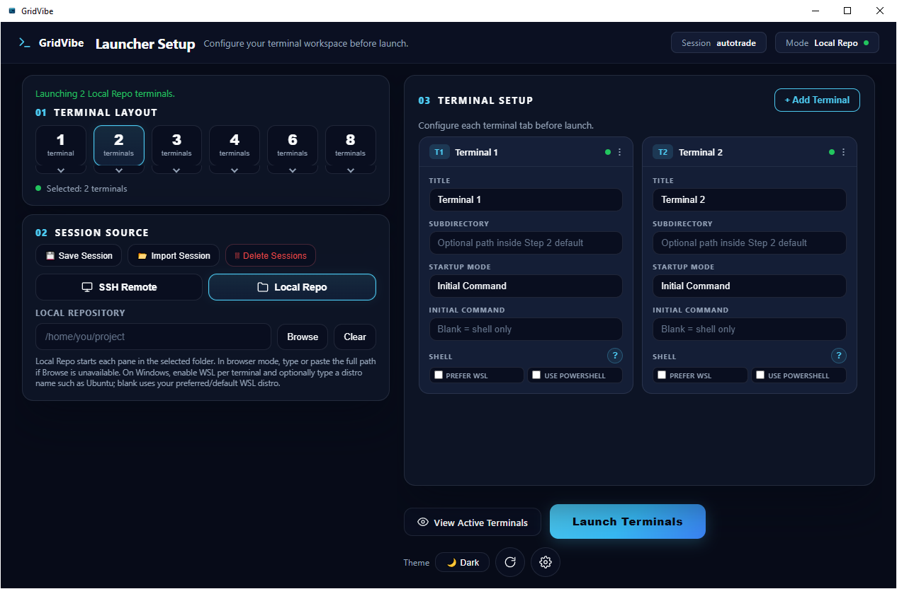
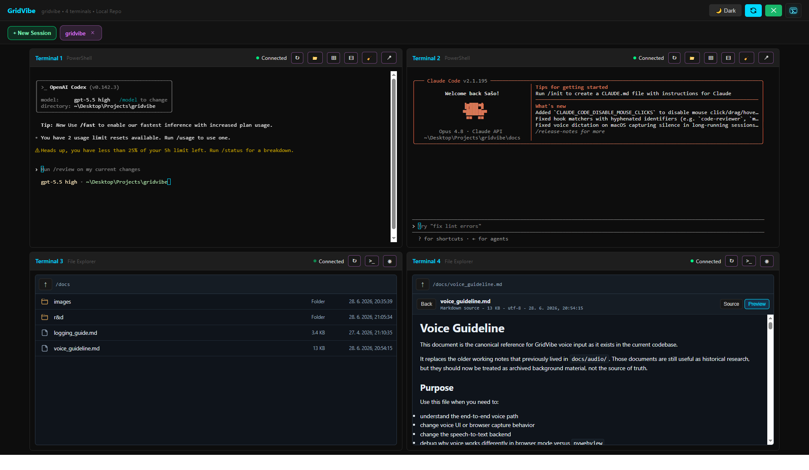

# GridVibe

GridVibe is a browser-first terminal workspace for launching and managing multiple SSH or local shell panes from one control surface. It runs in a normal browser or, when `pywebview` is installed, in a native desktop window on Windows.

[](https://github.com/JSstudent/gridvibe/actions/workflows/ci.yml)


## Screenshots

### Launcher



### Terminal Workspace



## Using the Workspace

### Terminal Buttons

The terminal workspace has global controls in the top bar and per-pane controls in each terminal header.

Top bar controls:

- `Theme` cycles between system, light, and dark mode.
- `Refresh` reloads session status and redraws terminal panes.
- `Close tab` closes the selected session group from its session tab.
- `Fullscreen` toggles the workspace into and out of fullscreen mode.
- `Settings` returns to the launcher page.

Per-terminal controls:

- `↻` resets that terminal view and replays the recent output buffer.
- `🧹` clears the terminal display and purges its replay buffer.
- `🗑` sends `Ctrl+U` to clear the current input line.
- `Enter` sends an Enter keypress to that terminal.
- `🎤` starts or stops voice input for that terminal when voice input is enabled.
- `Mic` opens voice capture settings for microphone selection, push-to-talk, and capture diagnostics.

Session tabs show each active session group. Drag tabs to reorder them; GridVibe persists the order for the running app state.

### Voice and Sound Settings

GridVibe does not play remote audio from terminal sessions. Sound-related settings are for microphone capture used by voice input.

Open `Mic` on a terminal pane to choose:

- `Profile`: headset or laptop microphone capture tuning.
- `Microphone`: browser default input or a specific available input device.
- `Push-to-talk`: optional hold-to-record mode with a custom keybind.
- `Requested vs actual capture`: diagnostics comparing the requested audio settings to what the browser actually applied.

Voice input requires the optional voice dependencies:

```bash
pip install -r requirements-voice.txt
```

Browser mode is usually the most reliable mode for microphone permissions. Native `pywebview` mode depends on the embedded browser and OS microphone support.

### General Settings

Use the gear button on the launcher page to open `App Settings`. These settings are saved to `config.json` and are not stored inside saved session presets.

- `Enable voice input` shows or hides voice controls and enables the speech-to-text path.
- `Theme` sets system, light, or dark mode.
- `Voice Backend` selects `Vosk` or `faster-whisper`.
- `Language` sets the voice recognition language, such as `en-US`.
- `Vosk Model` sets the local Vosk model folder/name.
- `Whisper Model`, `Device`, and `Compute Type` configure faster-whisper. GPU mode requires a working NVIDIA CUDA setup; use CPU if startup fails.

### Agent CLI Detection

GridVibe does not bundle agent CLIs such as Codex, Claude Code, OpenCode, Kilo, or GitHub Copilot CLI. The `Agent` selector checks whether the selected command is available in the target environment:

- SSH sessions are checked on the remote host.
- WSL terminals are checked inside the selected WSL distribution.
- PowerShell and cmd terminals are checked through the Windows environment that launched GridVibe.

If every agent shows `Missing`, confirm the CLI is installed and visible on `PATH` from a fresh terminal. For npm-installed agents on Windows, the global npm shim folder must usually be on your User PATH:

```powershell
npm prefix -g
Get-Command codex, claude, opencode, kilo, copilot -ErrorAction SilentlyContinue
```

The npm prefix is commonly:

```text
C:\Users\<you>\AppData\Roaming\npm
```

On Linux, npm global binaries usually live under the global prefix's `bin` directory. Confirm the path with:

```bash
npm prefix -g
command -v codex claude opencode kilo copilot
```

Common locations include `/usr/local/bin`, `~/.npm-global/bin`, or `<npm prefix -g>/bin`.

After changing PATH, restart your shell, GridVibe, and any native window launchers so they inherit the updated environment.

## Features

- Multi-session launcher with 1, 2, 3, 4, 6, or 8 panes
- SSH and local shell modes
- Saved launcher presets with encrypted SSH passwords
- Session groups with tabs and drag-to-reorder persistence
- xterm.js terminal panes with resize, refresh, clear, and replay buffer support
- Optional native desktop window through `pywebview`
- Optional offline voice input through Vosk or faster-whisper
- Theme support for system, light, and dark modes

## Quick Start

### Windows Install

Use the included launcher for the easiest Windows setup:

```powershell
.\GridVibe.bat
```

`GridVibe.bat` creates or repairs `.venv`, installs runtime and desktop dependencies, then launches the native window when possible.

Manual Windows setup:

```powershell
py -3 -m venv .venv
.\.venv\Scripts\Activate.ps1
python -m pip install --upgrade pip
pip install -r requirements.txt
python main.py --host 127.0.0.1
```

Open `http://localhost:5050`.

Install optional desktop-window support with:

```powershell
pip install -r requirements-desktop.txt
python webview_launcher.py
```

### Linux Install

Install Python 3.10+ and the venv package for your distro first. For Debian or Ubuntu:

```bash
sudo apt update
sudo apt install python3 python3-venv python3-pip
```

Then create the environment and start GridVibe:

```bash
python3 -m venv .venv
source .venv/bin/activate
python -m pip install --upgrade pip
pip install -r requirements.txt
python main.py --host 127.0.0.1
```

Open `http://localhost:5050`.

Optional native desktop-window support on Linux uses `pywebview` and may require distro GUI/WebKit packages in addition to:

```bash
pip install -r requirements-desktop.txt
python webview_launcher.py
```

### Manual Cross-Platform Setup

```bash
python -m venv .venv

# Linux / macOS
source .venv/bin/activate

# Windows PowerShell
.venv\Scripts\Activate.ps1

pip install -r requirements.txt
python main.py
```

Open `http://localhost:5050`.

On Windows, you can also run `GridVibe.bat`.

## Optional Dependencies

Native desktop window support:

```bash
pip install -r requirements-desktop.txt
```

Offline voice input support:

```bash
pip install -r requirements-voice.txt
```

Development tools:

```bash
pip install -r requirements-dev.txt
```

## Run Modes

```bash
python main.py                  # browser mode on http://localhost:5050
python main.py --host 127.0.0.1 # bind to localhost only
python main.py --port 8080      # custom port
python webview_launcher.py      # native window when pywebview is installed
```

## How It Works

- `main.py` starts Flask + Socket.IO and configures rotating logs.
- `web/api.py` contains HTTP routes, Socket.IO handlers, saved-session handling, SSH/local-shell logic, app settings, and voice integration.
- `sessions/manager.py` tracks in-memory session and session-group state.
- `templates/` contains the launcher and terminal workspace pages.

Live terminal sessions are in memory. If the Python process exits, running sessions end.

## Configuration

Runtime settings load from `config.json` when present, otherwise from `default_config.json`. `config.json` is intentionally ignored by git.

A minimal local override can look like this:

```json
{
  "server": {
    "host": "127.0.0.1",
    "port": 5050,
    "debug": false
  },
  "security": {
    "cors_origins": ["*"]
  },
  "appearance": {
    "theme": "system"
  },
  "voice_input": {
    "enabled": false,
    "engine": "whisper"
  }
}
```

GridVibe generates a Flask session signing key at startup unless `GRIDVIBE_SECRET_KEY`, `SECRET_KEY`, or a non-empty `security.secret_key` value is supplied through local config.

## Security Considerations

GridVibe is designed as a local desktop/browser tool, not a public web service.

- There is no built-in authentication or multi-user isolation.
- Flask-SocketIO is run with Werkzeug for local usage; do not expose it directly to the internet.
- Socket.IO defaults to wildcard CORS for local browser/native-window usage. Restrict `security.cors_origins` if you bind outside localhost.
- Paramiko currently uses `AutoAddPolicy`, which accepts unknown SSH host keys on first use.
- Saved SSH passwords are encrypted with Fernet before writing to `saved_sessions.json`.
- The Fernet key is stored in `.encryption_key`; Unix-like systems use `0600` permissions, while Windows users should rely on normal profile/account isolation or add stricter ACLs if needed.

See `SECURITY.md` for reporting and scope details.

## Voice Input

Voice input is optional. Install `requirements-voice.txt` before enabling it.

Supported engines:

- `whisper`: local faster-whisper inference inside the app process
- `vosk`: on-demand local WebSocket service started from `services/vosk_service.py`

The full voice implementation contract is in `docs/voice_guideline.md`.

## Development

```bash
make test
make lint
make fix
make check
```

On Windows without `make`:

```bash
python tests/run_tests.py
python -m ruff check .
```

## Project Layout

```text
gridvibe/
├── main.py
├── web/
├── sessions/
├── services/
├── templates/
├── tests/
├── docs/
├── default_config.json
├── requirements.txt
├── requirements-desktop.txt
├── requirements-voice.txt
├── requirements-dev.txt
├── pyproject.toml
└── GridVibe.bat
```

## Documentation

- `docs/logging_guide.md`
- `docs/voice_guideline.md`
- `CONTRIBUTING.md`
- `SECURITY.md`
- `CHANGELOG.md`

## Local Files

These are created or used at runtime and should not be committed:

| File | Purpose |
| --- | --- |
| `config.json` | Local runtime configuration override |
| `saved_sessions.json` | Saved launcher presets |
| `.encryption_key` | Fernet key used for password encryption |
| `logs/gridvibe.log` | Main rotating log file |

## License

MIT. See `LICENSE`.
