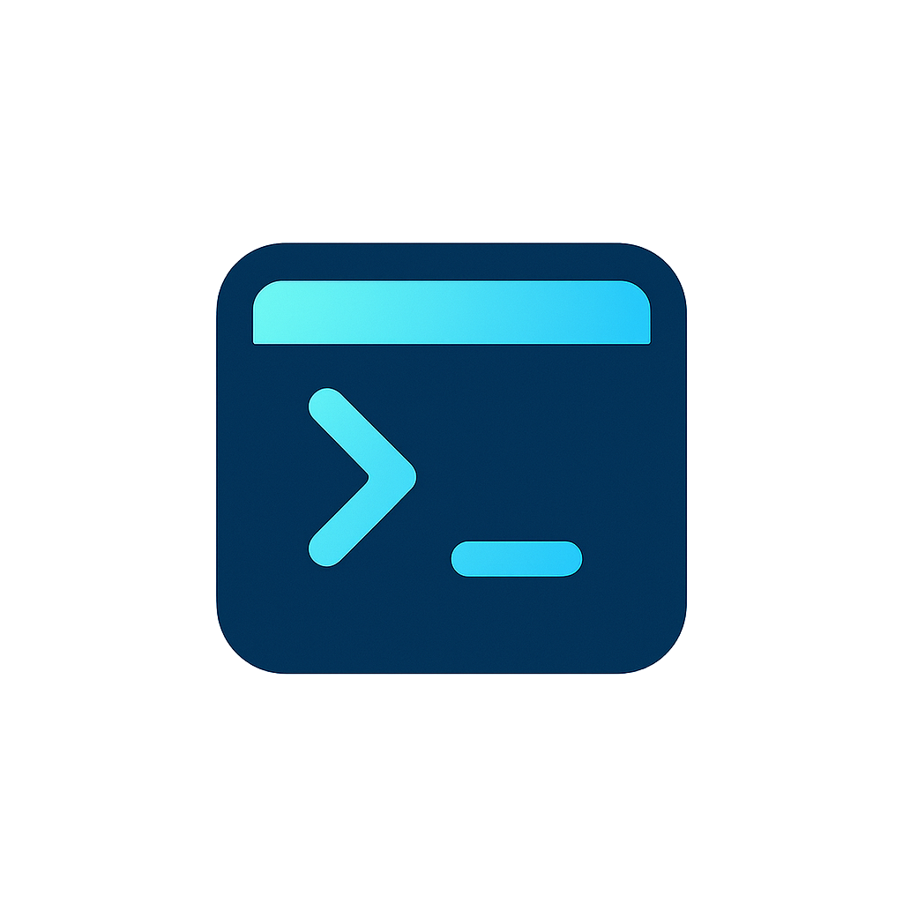
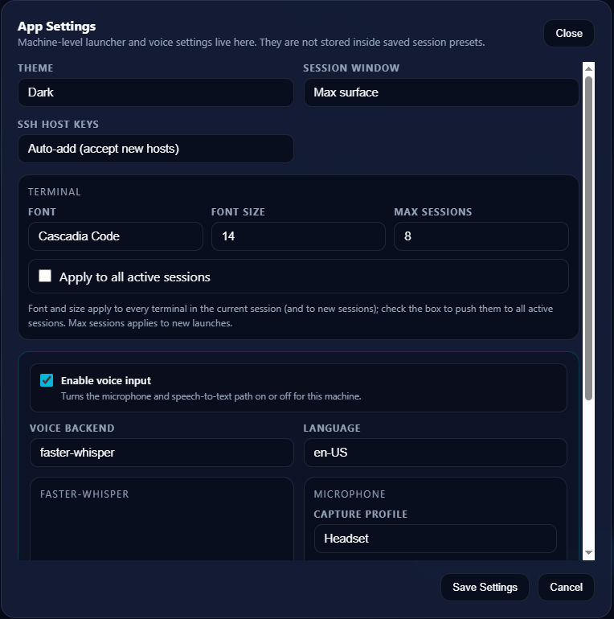

<p align="center">
  
</p>

<h1 align="center">GridVibe</h1>

<p align="center">
  Run many SSH terminals, local shells, agent CLIs, file explorers, and browser previews in one tabbed workspace — from your browser or a native desktop window.
</p>

<p align="center">
  <a href="https://github.com/JSstudent/gridvibe/actions/workflows/ci.yml"></a>
  
  
</p>

## Screenshots

| Launcher | Terminal Workspace | App Settings |
| --- | --- | --- |
|  |  |  |

## Quick Start

### Windows (easiest)

```powershell
.\START_HERE\Start GridVibe.bat
```

or run `GridVibe.bat` from the project root directly. The launcher creates/repairs `.venv`, installs the core dependencies, then asks whether to start in **Desktop** (native window) or **Browser** mode. It can also install the optional voice packages for you.

### Linux

```bash
sudo apt install python3 python3-venv python3-pip   # Debian/Ubuntu
chmod +x GridVibe.sh
./GridVibe.sh
```

The script sets up `.venv`, installs dependencies, then asks for **native** or **browser** mode. Browser mode opens `http://localhost:5050`.

### Manual (any platform)

```bash
python -m venv .venv
source .venv/bin/activate        # Windows PowerShell: .venv\Scripts\Activate.ps1
python -m pip install --upgrade pip
python -m pip install --upgrade -r requirements.txt
python main.py
```

Open `http://localhost:5050`. For a native desktop window, also install `requirements-desktop.txt` and run `python webview_launcher.py`.

## Run Modes

```bash
python main.py                  # browser mode on http://localhost:5050
python main.py --host 0.0.0.0   # bind on all network interfaces (opt-in)
python main.py --port 8080      # custom port
python webview_launcher.py      # auto: native window, browser fallback
python webview_launcher.py --mode browser
python webview_launcher.py --mode native
```

## What You Can Do

- Launch 1, 2, 3, 4, 6, or 8 panes per session group: SSH hosts, WSL distributions, PowerShell, cmd, or local repositories.
- Start each pane as a shell, an agent CLI (Codex, Claude Code, OpenCode, Kilo, Kimi Code CLI, GitHub Copilot CLI), a file explorer, or a browser preview.
- Group sessions into numbered, draggable, closable tabs (`Alt+1`–`Alt+9` to switch).
- Save the whole workspace as a preset and restore it later — including after an app restart (`runtime_state.json`, never passwords). SSH passwords are stored encrypted in `saved_sessions.json`.
- Broadcast typing to every pane in a group, search scrollback (`Ctrl+Shift+F`), click URLs in output, split panes, and drag-resize dividers.
- Browse files read-only over SFTP or locally, with a file tree, Markdown/text preview, syntax coloring, and a Git sidebar (status, diffs, commit graph, staging/commit/publish).
- Dictate into any terminal with optional offline voice input (Vosk or faster-whisper).
- Theme the whole app (system/light/dark), collapse the top bar, or go max-surface/fullscreen.

## Using the Workspace

**Top bar:** theme, refresh, max surface, broadcast typing, fullscreen, and a button back to the launcher.

**Session tabs:** drag to reorder, `Alt+1`–`Alt+9` to switch, `Sessions...` to import/save workspace presets, close button per tab, and a chevron to hide the top bar.

**Per pane:**

- `↻` — reset the view and replay recent output (reloads explorers and browser panes)
- `📁` / `>_` — switch between terminal and file explorer at the current directory
- `🌐` / `>_` — switch a Local Repo pane between terminal and browser preview
- `⊞` — split the pane (clones the connection)
- `🧹` — clear the display and replay buffer
- `🎤` — start/stop voice input (when enabled)
- Drag the dividers between panes to resize them.

## File Explorer Panes

Explorers are read-only views of a local repo folder or a remote SSH host (over SFTP), rooted at the folder you picked. They offer directory search, a lazily loaded file tree sidebar, text/Markdown preview with syntax coloring and font zoom, in-file find (`Ctrl+F`), and file download (100 MB cap).

The Git sidebar shows branch/dirty status, per-file badges, a colour-coded commit graph, and historical diffs. The only mutating actions are staging/unstaging, commit, branch publishing (push), and discarding unstaged changes of tracked files — file moving, editing, deleting, upload, checkout, pull, and merge are intentionally not supported.

## Browser Panes

Local Repo panes can show an `http://`/`https://` URL in a sandboxed iframe, with an editable address bar and an `Open` fallback for sites that block embedding. GridVibe does not proxy pages or bypass `X-Frame-Options`/CSP restrictions.

## Voice Input

Voice input is optional and fully offline. Install the dependencies first (on Windows, `GridVibe.bat` offers to do this):

```bash
python -m pip install --upgrade -r requirements-voice.txt
```

Enable it in `App Settings` (launcher gear button), pick a backend — `Vosk` or `faster-whisper` — a language, and optionally a capture profile, microphone, and push-to-talk keybind. Browser mode is the most reliable for microphone permissions. Details: `docs/voice_guideline.md`.

## Agent CLI Detection

GridVibe does not bundle agent CLIs; it checks whether each one is on `PATH` in the target environment (remote host for SSH, the chosen distro for WSL, Windows for PowerShell/cmd). If everything shows `Missing`, install the CLI and make sure its folder is on `PATH` — for npm-installed agents on Windows that is typically `%APPDATA%\npm` (check with `npm prefix -g`). Restart GridVibe after PATH changes.

## Configuration

Runtime settings load from `config.json` (git-ignored), falling back to `default_config.json`. Everything is also editable in `App Settings` on the launcher. Example:

```json
{
  "server": { "host": "127.0.0.1", "port": 5050 },
  "appearance": { "theme": "system" },
  "ssh": { "host_key_policy": "auto-add" }
}
```

GridVibe generates a Flask session signing key at startup unless `GRIDVIBE_SECRET_KEY`, `SECRET_KEY`, or `security.secret_key` is set.

## Security

GridVibe is a local tool, not a public web service: it binds to `127.0.0.1` by default, has no built-in authentication, and should not be exposed to the internet.

- Socket.IO CORS defaults to same-origin; state-changing cross-origin requests are rejected. Configure `security.cors_origins` only if you serve GridVibe from another origin.
- SSH host keys are persisted to `.known_hosts`; `ssh.host_key_policy` can be `auto-add` (default), `known-hosts`, or `strict`.
- Saved SSH passwords are encrypted with Fernet; the key lives in `.encryption_key`.

See `SECURITY.md` for reporting and scope.

## Development

```bash
make test lint fix check        # or, on Windows without make:
python tests/run_tests.py
python -m ruff check .
```

Backend code lives in the modular `web/` package (`app.py`, `api.py`, `agents.py`, `terminal_io.py`, `explorer.py`, `voice.py`, …), session state in `sessions/manager.py`, the voice service in `services/`, and the two pages in `templates/` with assets in `web/static/`. Root-level `api.py`, `session_manager.py`, `cleanup.py`, and `webview_launcher.py` are compatibility shims — edit the canonical modules instead.

More docs: `docs/logging_guide.md`, `docs/voice_guideline.md`, `CONTRIBUTING.md`, `CHANGELOG.md`.

## Local Files

Created at runtime, never committed:

| File | Purpose |
| --- | --- |
| `config.json` | Local runtime configuration override |
| `saved_sessions.json` | Saved launcher presets (encrypted passwords) |
| `runtime_state.json` | Workspace-shape snapshot for restore-after-restart |
| `.known_hosts` | Persisted SSH host keys |
| `.encryption_key` | Fernet key for password encryption |
| `logs/gridvibe.log` | Main rotating log file |

## License

MIT. See `LICENSE`.
