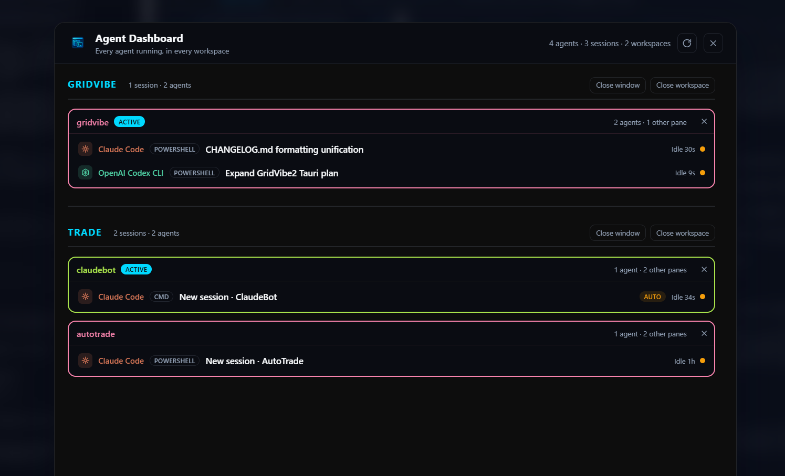

<p align="center">
  
</p>

<h1 align="center">GridVibe</h1>

<p align="center">
  <b>The vibe-coding cockpit.</b><br>
  Spin up a grid of AI agent CLIs and SSH terminals in seconds, talk to them out loud,<br>
  and keep your files, Git, and a live app preview in the same window.
</p>

<p align="center">
  <a href="https://github.com/JSstudent/gridvibe/actions/workflows/ci.yml"></a>
  
  
</p>

---

## Why GridVibe

- **A grid, not a tab pile.** Pick 1, 2, 3, 4, 6, or 8 panes, pick a target per pane, hit launch. SSH, WSL, PowerShell, cmd, or a local repo — side by side, resizable, splittable.
- **Agents are a dropdown, not a chore.** Eight agent CLIs are first-class pane types, most with an **Auto mode** toggle. GridVibe checks for the binary on the target machine, so you hear about a missing install *before* the pane opens.
- **Talk to your agents.** Fully offline voice input dictates straight into any terminal — or into the file you have open in the explorer's editor. Push-to-talk included. Off by default.
- **Never leave the grid.** A file explorer, a Git sidebar, and a live browser preview drop into any pane, so your files, your commits, and the running app are all one click away.
- **Set it up once.** Save a tab as a preset, save the whole workspace, restart, get it all back — right down to which group you were working in.

## Screenshots

| Launcher | Agents| Terminal Workspace | Browser | Agents Dashboard |
| --- | --- | --- | --- | --- |
|  |  |  |  |  |

## Quick Start

**Python 3.10+ is the only prerequisite.** The launcher scripts create and repair the virtual environment, install dependencies, and start the app.

```powershell
# Windows
.\START_HERE\Start GridVibe.bat
```

```bash
# Linux / macOS
sudo apt install python3 python3-venv python3-pip   # Debian/Ubuntu
chmod +x GridVibe.sh && ./GridVibe.sh
```

```bash
# Manual, any platform
python -m venv .venv
source .venv/bin/activate        # Windows PowerShell: .venv\Scripts\Activate.ps1
python -m pip install --upgrade -r requirements.txt
python main.py                   # → http://localhost:5050
```

Both launchers ask for **Desktop** (native window) or **Browser** mode. Local cmd/PowerShell/WSL panes work in either; a native window also needs `requirements-desktop.txt`.

After a successful first run, an unchanged environment starts without touching pip — including offline. Changed requirements, a different interpreter, or a failed import check trigger setup again. To force a full reinstall and verification, run the root launcher with `--repair` (`.\GridVibe.bat --repair` or `./GridVibe.sh --repair`).

### Getting & updating it

| | Get it | Update it |
| --- | --- | --- |
| **Clone** (recommended) | `git clone https://github.com/JSstudent/gridvibe.git` | The launcher's **Check for updates** button fast-forwards in place |
| **Release ZIP** (no Git) | **Source code (zip)** from [Releases](https://github.com/JSstudent/gridvibe/releases) | Download the next release — in-app update needs a clone, and says so |

A Windows installer that bundles Python is planned for **2.0.0**.

### Run modes

```bash
python main.py                     # browser mode on http://localhost:5050
python main.py --host 0.0.0.0      # bind all interfaces (opt-in)
python main.py --port 8080         # custom port
python webview_launcher.py         # auto: native window, browser fallback
python webview_launcher.py --mode browser|native
```

- **Native desktop mode** — the launcher and each workspace are real OS windows. **Minimize all** (`Alt+X`, or the top-bar button) sends every GridVibe window to the taskbar at once, and App Settings can make minimizing any one of them do the same.
- **Browser mode** — the launcher opens in a new browser window and each workspace as a tab beside it. Browsers only allow one tab per click, so restoring several workspaces at once opens the first and reports the rest. Allow pop-ups for GridVibe's address to get them all.

## Agent CLIs

Pick an agent per pane in the launcher. GridVibe checks whether the binary is on `PATH` **in the target environment** (the remote host for SSH, the chosen distro for WSL, Windows for PowerShell/cmd) and shows install guidance when it isn't.

| Agent | Binary | Auto mode |
| --- | --- | --- |
| Claude Code | `claude` | Yes |
| OpenAI Codex CLI | `codex` | Yes |
| GitHub Copilot CLI | `copilot` | Yes |
| OpenCode CLI | `opencode` | — |
| Kilo CLI | `kilo` | Yes |
| Kimi Code CLI | `kimi` | Yes |
| Grok Build (xAI) | `grok` | Yes |
| Hermes Agent | `hermes` | Yes |

GridVibe does not bundle the CLIs. If everything shows `Missing`, install it and put its folder on `PATH` — for npm-installed agents on Windows that is usually `%APPDATA%\npm` (check with `npm prefix -g`). Restart GridVibe after PATH changes.

## Voice Input

Optional, fully offline, **off by default**. Turn it on in **App Settings** (the gear on either page), pick a backend (`Vosk` or `faster-whisper`), a language, and optionally a capture profile, microphone, and push-to-talk keybind.

- **In a terminal** — hit the 🎙️ button in any pane header and talk.
- **In a file** — the explorer's in-place editor gets its own 🎙️ beside **Save**. Dictation lands at the caret and undoes with `Ctrl+Z` in one step.
- **One mic at a time**, terminals and editors alike. Leaving edit mode stops recording.
- **Missing packages?** App Settings offers **Install voice dependencies** and loads them without a restart, or run `python -m pip install --upgrade -r requirements-voice.txt`.

Browser mode is the most reliable for microphone permissions. Settings apply live to open workspace tabs. Details: [`docs/voice_guideline.md`](docs/voice_guideline.md).

## Sessions & Workspaces

- **Session tabs** — keep related panes together in draggable tabs. `Alt+1`–`Alt+9` switches, middle-click closes, and broadcast typing sends your keystrokes to every pane in the active tab.
- **Saved sessions** — save a setup as a reusable preset and import it later; re-saving one records where each pane is working now, not where the preset was created. Stored SSH passwords are encrypted, and are never written to a workspace snapshot.
- **Save & restore** — GridVibe autosaves, and **Save Workspace** saves on demand. A restart brings back tabs, layouts, commands, the active group, and explorer presentation, with each pane reopening in the directory it was *working in*.
- **Close & restart** — voluntary close, manual restart, and update restart share one in-page choice: continue without saving, save every workspace, or save every preset and then every workspace. A failed save leaves the app open.
- **Multiple workspaces** — optionally keep separate projects in separate windows, move tabs between them without restarting terminals, and switch with `Alt+W` / `Alt+Shift+W`.
- **The launcher follows you** — opening it from a workspace (`Alt+Q`) brings its window up on that workspace's screen, with the next launch already aimed at that workspace. The caret beside **Launch** picks any other destination, and a launcher already on that screen stays where you put it.
- **Updates** — **Check for updates** fast-forwards a Git clone, then offers the same save choices.

If a local pane's folder has been deleted since it was saved, the pane opens with a notice naming it and does not run its startup command or agent somewhere else. The saved path is kept, so the pane comes back correctly once the folder does.

Closing a workspace ends its terminals but keeps it available to restore. **Close and forget** drops both the workspace and its snapshot; closing only the window leaves its terminals running.

## Agent Dashboard

One panel over whatever page you are on (`Alt+A`, or the button beside the session menu and in the launcher's control row) listing **every session in every workspace**, agents first.

- **Three levels** — a workspace is a titled band, a session tab is a card inside it drawn in that tab's own colour, and each agent is one row inside the card.
- **Every agent on one line** — its mark and name, what it runs on (`SSH`, `WSL`, `PowerShell`, `cmd`), the chat title it announced, `auto` when it was launched with auto-approval, and what it is doing right now.
- **A badge that means something** — the button counts the agents **working right now**, not how many you have open. No badge means every agent is sitting at a prompt.
- **Click anything to go there** — a row, its session, or its workspace opens or focuses that window at that tab.
- **Sessions without agents are listed too**, sorted after the ones that have them, because this is also the fastest way to reach any tab in any window.
- **Nothing is probed** — both readings come from the pane's own output, and nothing is ever typed into a running agent.

A pane running an agent also renames itself after it: `Terminal 1` becomes `Claude Code`, with that agent's icon beside it. A title you typed yourself always wins.

## File Explorer

Swap any pane between a terminal and a file explorer with one button — same directory, no re-navigation. Works on a local repo folder or a remote host over SFTP.

- **Files follows your shell** — opening the explorer roots on the Git repository your terminal is standing in, whatever root the pane had before. `cd` somewhere else and open Files again to re-root there.
- **Browse & preview** — breadcrumbs, a lazy Files tree, draggable file tabs, syntax-coloured source, rendered Markdown and Mermaid, inline images, and downloads.
- **Edit in place** — open any UTF-8 text file, edit it, and save with `Ctrl+S`. Saves are atomic, and a conflict prompt protects files that changed on disk.
- **Search the repo** (`Ctrl+Shift+F`) — case, whole-word, regex, file-pattern, scope, and `.gitignore` controls, with results marked when a limit is hit.
- **Find a file** — the Files tree's filter box finds files and folders by name anywhere under the root, with the matched part highlighted in place.
- **Fold a level** — `Alt`-click a fold arrow to fold or unfold every folder beside it, so one click collapses the whole tree.
- **Manage files** — create, copy, move, rename, and delete from the context menu. Every write stays inside the explorer root, nothing is ever overwritten, and deletion asks first.
- **Upload files** — through the usual picker, from any folder row or the explorer bar. Local or SFTP, multi-select, 100 MB per file. A name already in use is numbered (`report (1).pdf`), never replaced.
- **Select several** — `Ctrl`-click to add or remove rows, `Shift`-click for a range. Copy, Cut, Delete, Download, and Copy path act on the whole selection with one confirmation.
- **Big files stay usable** — very large files open in a plain fast view with a notice saying what is turned off, and large diffs keep side-by-side layout, line numbers, and undo.
- **Restores with your workspace** — root, ordered tabs, view mode, scroll, wrapping, folds, sidebar width, theme, and Markdown appearance.

### Git sidebar

- **Status & history** — repository, branch, staged and unstaged changes, and the commit graph. Diff the working tree or any commit, with per-line and per-block undo.
- **Actions** — stage, unstage, commit, publish/push, and discard. **Stage All** and **Unstage All** only move entries in and out of the index; **Discard All** asks first.
- **Scope** — **pin** the sidebar to a path, or let the **chain** button follow whatever you browse. Both go down to a single file, are marked in the Files tree, and survive a restart. Every action obeys the scope and names it in its tooltip.
- **Graph** — the newest 60 commits, plus 60 more per **Show more**, up to 300. The magnifier finds a commit by subject or id with `Enter`/`Shift+Enter` stepping, and `Alt`-click collapses every commit.
- **Commit card** — right-click a commit for the full message, the author, the date in the author's own time zone, the object id, and any branch or tag, each with a copy button.

Cross-root transfers and Git checkout, pull, or merge are intentionally left to the terminal.

## Switching a Pane's Shell or Agent

Launched a pane in cmd and wanted PowerShell — or Codex in WSL? Click the pane's 🔄 button.

- **Pick a shell** — a Local Repo terminal on Windows lists **Command Prompt**, **PowerShell**, **WSL**, and every detected distro. The pane restarts in place, same slot, same title, in the directory the old shell was sitting in.
- **Pick an agent** — each shell row's chevron opens **Plain shell** plus every agent, so "this pane, but Codex in WSL" is one click. SSH panes and non-Windows hosts get that list flat.
- **Plain shell** drops a running agent and comes back to an ordinary prompt. Picking whatever is already checked relaunches it too.
- **A missing agent never touches your pane** — GridVibe runs the same install check against that row's own target, and answers with a message (*OpenAI Codex CLI is missing in WSL Ubuntu.*) instead of relaunching.
- **Auto mode follows the agent**, not the pane: relaunch the same agent under another shell and it stays on.

## Browser Preview

Flip a Local Repo pane to a browser preview (the 🌐 button) and watch the app you're building next to the terminal running it.

- **Tabbed** — up to 8 tabs, per-tab close, drag to reorder, **+** opens a blank tab at `http://127.0.0.1:3000`. Each tab keeps its own live frame, so switching never reloads your app.
- **URL bar** navigates the active tab (http/https only); **Open** kicks it out to a real OS browser tab.
- **Same-origin popups get captured** into new pane tabs instead of escaping. Named window targets reuse their tab rather than stacking up.
- **Nested preview is capped one level deep**, so a GridVibe page inside a pane doesn't re-embed itself forever.
- The whole tab strip saves and restores with the workspace and with session presets.

GridVibe does not proxy pages or bypass `X-Frame-Options`/CSP, so sites that block embedding need **Open**.

## Keyboard Shortcuts

**The whole list is in the app.** The keyboard button — in the workspace top bar, and in the launcher's bottom action bar — opens a read-only panel with every chord, grouped the way you would look for it. Rows that only apply in one mode say so rather than disappearing.

| Shortcut | Action |
| --- | --- |
| **Navigation** | |
| `Alt+1` – `Alt+9` | Switch session group |
| `Alt+W` / `Alt+Shift+W` | Next / previous workspace window (multiple workspaces only) |
| `Alt+W` | Return to the workspace that opened the launcher (on the launcher page) |
| `Alt+Q` | Open the launcher (in a workspace window) |
| `Alt+A` | Open the agent dashboard |
| **Terminal** | |
| `Ctrl+Shift+F` | Search the scrollback |
| `Ctrl+Shift+C` | Copy the selection |
| `Ctrl+V` | Paste into the pane |
| **Explorer** | |
| `Ctrl+F` | Find in the open file |
| `Ctrl+Shift+F` | Toggle repository search |
| `Ctrl+Shift+V` | Toggle the Markdown preview |
| `F5` | Refresh the focused explorer |
| `Enter` / `Shift+Enter` / `↑` / `↓` | Step through find matches (in any find bar) |
| `Esc` | Drop the selection, or close the open menu |
| **Editor** | |
| `Ctrl+Shift+E` | Edit the open file in place — and, while editing, cancel |
| `Ctrl+S` | Save |
| `Tab` | Indent |
| **Window** | |
| `Alt+X` | Minimize every GridVibe window (native window only) |

**Mouse:** `Alt`+click folds a whole sibling level in the Files tree, or collapses every commit in the Git graph. `Ctrl`+click and `Shift`+click extend the explorer selection. Drag the dividers between panes to resize them.

The one configurable chord in GridVibe is voice push-to-talk, set in App Settings.

## Icons

**Pane header:**

| | Does |
| :---: | --- |
| 🔄 | Reset the view and replay recent output. On a terminal it opens a dropdown that also relaunches the pane in another shell and/or under another agent |
| 📁 ⇄ 💻 | Swap between terminal and file explorer at the current directory |
| 🌐 ⇄ 💻 | Swap a Local Repo pane between terminal and browser preview |
| 🪟 | Split side-by-side or stacked. A terminal clones its connection where it *is*; an explorer or browser pane splits off a terminal rooted where it is browsing |
| 🧹 | Clear the display and purge the replay buffer |
| 🎙️ | Start/stop voice input (when enabled) |
| 🌙 ⇄ ☀️ | Toggle an explorer pane between dark and light |
| ⋯ | Overflow menu, shown when the pane is too narrow for the full row |
| ✖️ | Close the pane (confirms first — it's a live session) |

**Explorer bar:**

| | Does |
| :---: | --- |
| 🔄 | Refresh the explorer (`F5`) |
| ⬆️ | Go to the parent directory (or mouse Back) |
| 🗂️ | Files tree sidebar |
| ⎇ | Git changes and history sidebar |
| 🔍 | Repository search sidebar (`Ctrl+Shift+F`) |
| 📤 | Upload files into the folder this pane is showing |
| 🖥️ | Reveal the current location in the system file manager (local panes only) |

**Top bar:** theme · max surface · broadcast typing · fullscreen · minimize all windows (native desktop mode only) · keyboard shortcuts · App Settings · chevron to hide the bar. Hide it and it slides back on hover from the handle at the top edge.

**Session tab line:** the GridVibe menu, the agent dashboard button, and the back-to-launcher button sit ahead of the first tab, so they stay reachable with the top bar hidden. The menu holds two rows — **Sessions** (import, save, save as, save all) and **Workspace** (save, rename, new, open, move session, close) — and pointing at either opens its items beside it.

## Configuration

Everything lives in **App Settings** — the same dialog from the gear on the launcher *or* a session window. It covers theme, surface mode, terminal font and size, max sessions, shell integration, autosave interval, SSH host-key policy, all voice options, and, in the native window, whether minimizing one GridVibe window minimizes them all. The one exception is **Multiple workspaces**, whose switch sits in the launcher's Workspaces card because it changes what every launch does.

On disk, settings load from `config.json` (git-ignored) falling back to `default_config.json`:

```json
{
  "server": { "host": "127.0.0.1", "port": 5050 },
  "appearance": { "theme": "dark" },
  "terminal": { "max_sessions": 16, "font_size": 14, "shell_integration": true },
  "workspace": { "surface_mode": "normal", "autosave_interval_minutes": 5, "multi_workspace_enabled": false, "minimize_cascade": false },
  "ssh": { "host_key_policy": "auto-add" },
  "explorer_search": { "max_files": 2000, "max_matches": 5000, "timeout_seconds": 20 }
}
```

Settings updates merge with the latest file under a cross-process lock, so two GridVibe processes cannot clobber each other. A damaged file is quarantined and recovered from its backup, and a failed save is reported rather than silently dropped. GridVibe generates a Flask session signing key at startup unless `GRIDVIBE_SECRET_KEY`, `SECRET_KEY`, or `security.secret_key` is set.

### Shell integration

`terminal.shell_integration` (on by default) is what lets GridVibe follow the directory a terminal is *in*, rather than the one it was launched in — which is the directory the file explorer opens on when you switch a pane over.

It adds an invisible escape sequence to the shell's prompt and reads the path back out of the terminal's own output, so it never types at your prompt and stays right while a build, a pager, a TUI, or an agent is running. A local shell is handed the hook at startup with nothing shown in the pane; a remote shell cannot be handed anything, so SSH panes are sent one short line that the shell echoes.

What it costs: that one echoed line on SSH panes, and **cmd's `PROMPT` is replaced** with the default `$P$G` plus the sequence. An existing bash/zsh hook is appended to, and PowerShell's `prompt` function is wrapped rather than replaced. Turn the setting off to leave every prompt untouched.

## Security

GridVibe is a local tool, not a public web service: it binds to `127.0.0.1` by default, has no built-in authentication, and should not be exposed to the internet.

- Socket.IO CORS defaults to same-origin, following the address the server actually resolved plus the host each request was addressed to; state-changing cross-origin requests are rejected on the same rule. Set `security.cors_origins` only if you serve GridVibe from another origin.
- SSH host keys persist to `.known_hosts`; `ssh.host_key_policy` can be `auto-add` (default), `known-hosts`, or `strict`. All modes reject changed keys, and an unreadable trust file refuses the connection rather than being overwritten.
- Saved SSH passwords are Fernet-encrypted; the key lives in `.encryption_key`.

See [`SECURITY.md`](SECURITY.md) for reporting and scope.

## Development

```bash
make check                      # test + lint, run this before handing work back
make test lint fix              # individually

# Windows without make:
python tests/run_tests.py
python -m ruff check .
```

Backend lives in the modular `web/` package, session state in `sessions/manager.py`, the voice service in `services/`, and the two pages in `templates/` with assets in `web/static/`. Root-level `api.py`, `session_manager.py`, `cleanup.py`, and `webview_launcher.py` are compatibility shims — edit the canonical modules.

More: [`CONTRIBUTING.md`](CONTRIBUTING.md) · [`CHANGELOG.md`](CHANGELOG.md) · [`docs/logging_guide.md`](docs/logging_guide.md) · [`docs/voice_guideline.md`](docs/voice_guideline.md) · [`docs/session_state_guideline.md`](docs/session_state_guideline.md)

## Local Files

Created at runtime, never committed:

| File | Purpose |
| --- | --- |
| `config.json` | Local runtime configuration override |
| `saved_sessions.json` | Saved launcher presets (encrypted passwords) |
| `runtime_state.json` | Workspace-shape snapshot for restore-after-restart |
| `.known_hosts` | Persisted SSH host keys |
| `.encryption_key` | Fernet key for password encryption |
| `logs/gridvibe.log` | Main rotating log file |

All three JSON state files are written the same careful way: one change at a time under an OS-level lock, committed through an atomic replace, with the previous version kept as `<file>.bak`. A file GridVibe cannot read is moved aside as `<file>.corrupt-<timestamp>` and the backup is loaded in its place. The developer-facing contract is [`docs/session_state_guideline.md`](docs/session_state_guideline.md).

## License

MIT. See [`LICENSE`](LICENSE).
