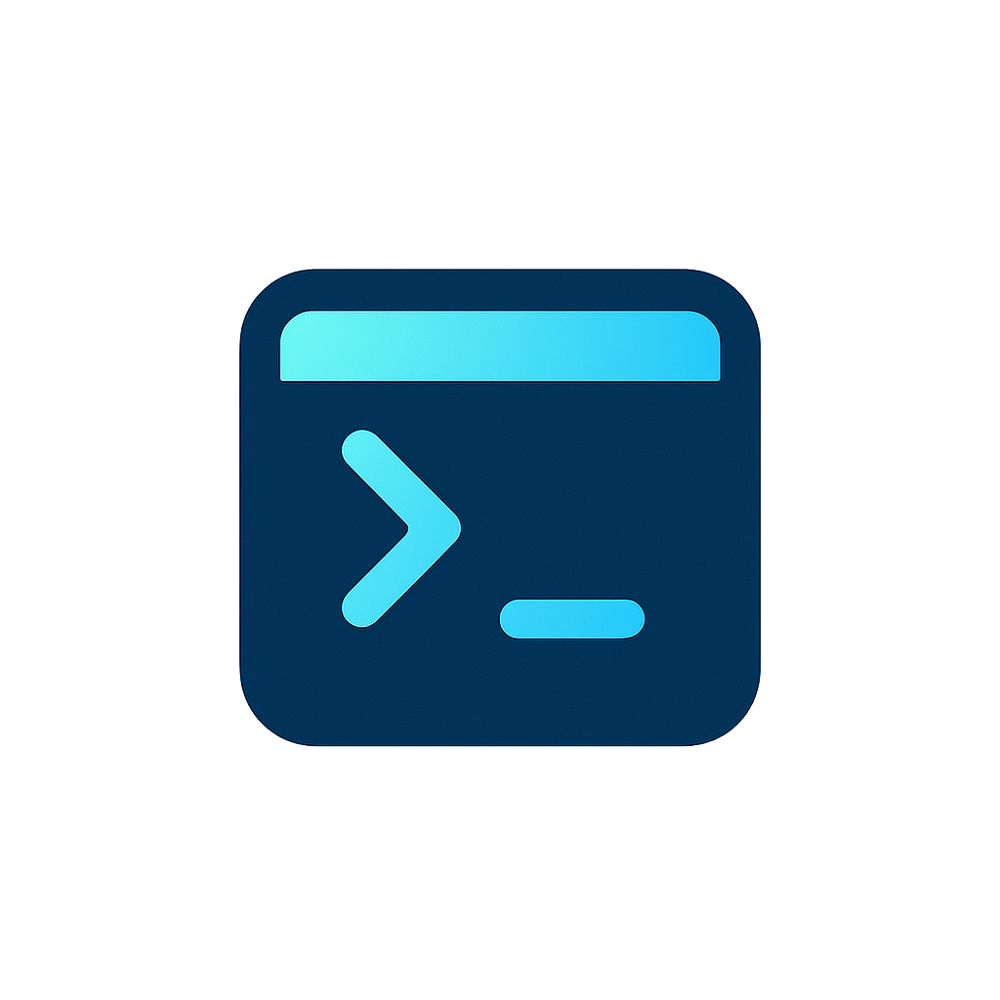
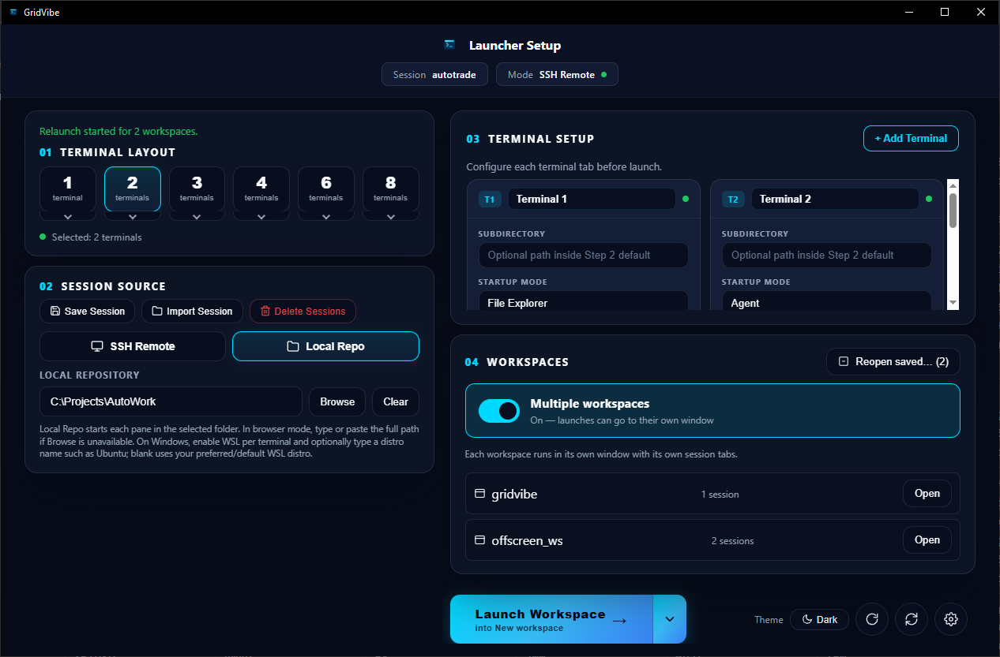
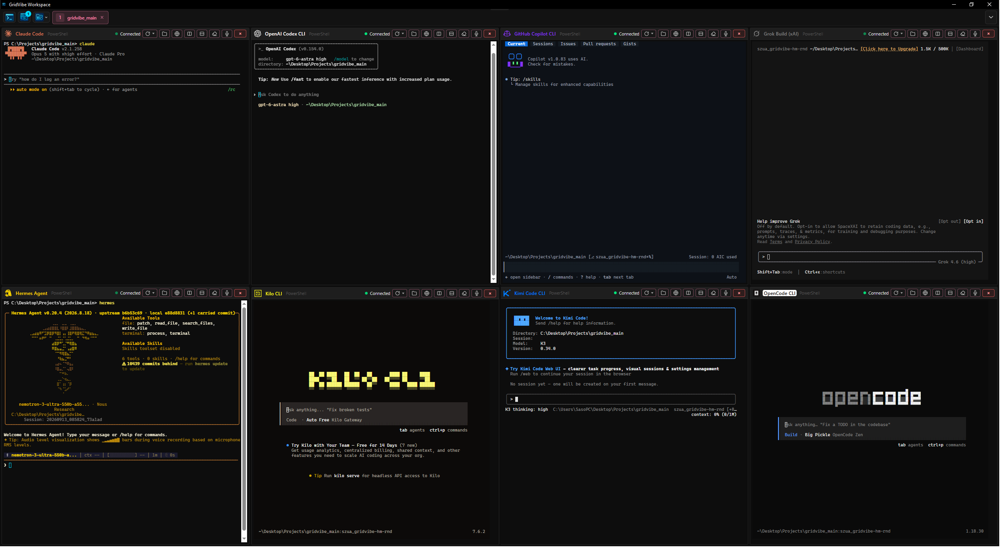
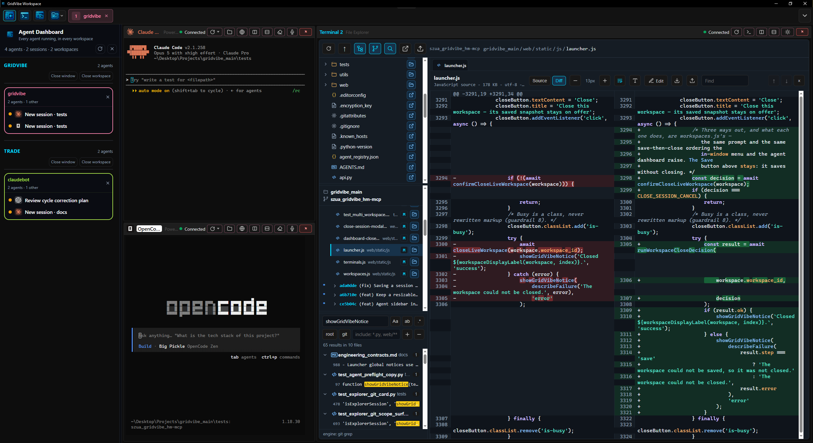
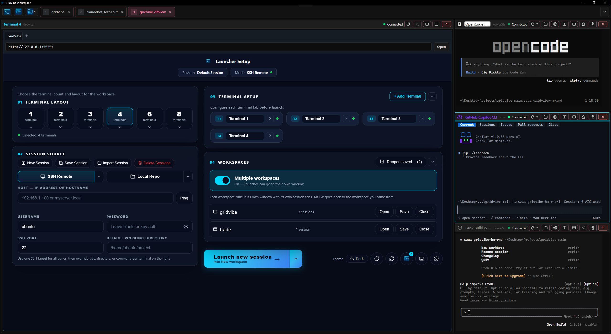
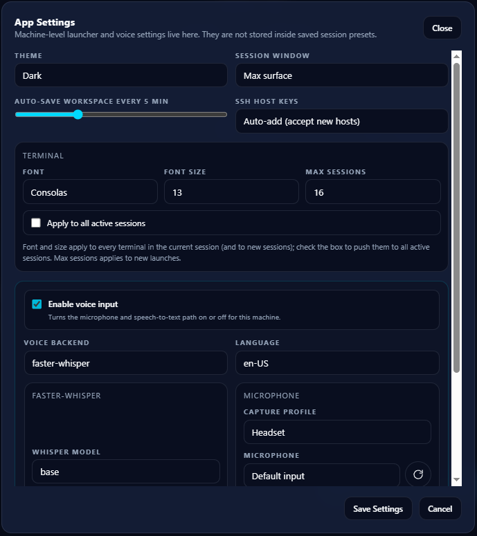

<p align="center">
  
</p>

<h1 align="center">GridVibe</h1>

<p align="center">
  <b>The vibe-coding cockpit.</b><br>
  Spin up a grid of AI agent CLIs and SSH terminals in seconds, talk to them out loud,<br>
  and keep your files, Git, and a live app preview in the same window.
</p>

<p align="center">
  <a href="https://github.com/JSstudent/gridvibe/actions/workflows/ci.yml"></a>
  
  
</p>

---

## Why GridVibe

| | |
| --- | --- |
| **A grid, not a tab pile** | Pick 1, 2, 3, 4, 6, or 8 panes, pick a target per pane, hit launch. SSH, WSL, PowerShell, cmd, or a local repo — side by side, resizable, splittable. |
| **Agents are a dropdown, not a chore** | Six agent CLIs are first-class pane types, most with an **Auto mode** toggle. GridVibe detects them on the target machine before you launch, so you find out about a missing binary *before* the pane opens. |
| **Talk to your agents** | Fully offline voice input (Vosk or faster-whisper) dictates straight into any pane. Push-to-talk keybind included. Off by default. |
| **Set it up once** | Save a tab as a preset, save the whole workspace, restart, get it all back — right down to which group you were working in. |

Everything else — the file explorer, the Git sidebar, the browser preview — exists so you never have to leave the grid mid-flow.

## Screenshots

| Launcher | Agents| Terminal Workspace | Browser | App Settings |
| --- | --- | --- | --- | --- |
|  |  |  |  |  |

## Quick Start

**Python 3.10+ is the only prerequisite.** The launcher scripts create and repair the virtual environment, install dependencies, and start the app.

```powershell
# Windows
.\START_HERE\Start GridVibe.bat
```

```bash
# Linux / macOS
sudo apt install python3 python3-venv python3-pip   # Debian/Ubuntu
chmod +x GridVibe.sh && ./GridVibe.sh
```

```bash
# Manual, any platform
python -m venv .venv
source .venv/bin/activate        # Windows PowerShell: .venv\Scripts\Activate.ps1
python -m pip install --upgrade -r requirements.txt
python main.py                   # → http://localhost:5050
```

Both launchers ask for **Desktop** (native window) or **Browser** mode. Core requirements already include `pywinpty` on Windows, so local cmd/PowerShell/WSL panes work in browser mode too. For a native window, also install `requirements-desktop.txt`.

### Getting & updating it

| | Get it | Update it |
| --- | --- | --- |
| **Clone** (recommended) | `git clone https://github.com/JSstudent/gridvibe.git` | The launcher's **Check for updates** button fast-forwards in place |
| **Release ZIP** (no Git) | **Source code (zip)** from [Releases](https://github.com/JSstudent/gridvibe/releases) | Download the next release — in-app update needs a clone, and says so |

A Windows installer that bundles Python is planned for **2.0.0**.

### Run modes

```bash
python main.py                     # browser mode on http://localhost:5050
python main.py --host 0.0.0.0      # bind all interfaces (opt-in)
python main.py --port 8080         # custom port
python webview_launcher.py         # auto: native window, browser fallback
python webview_launcher.py --mode browser|native
```

## Agent CLIs

Pick an agent per pane in the launcher. GridVibe checks whether the binary is on `PATH` **in the target environment** (the remote host for SSH, the chosen distro for WSL, Windows for PowerShell/cmd) and shows install guidance when it isn't.

| Agent | Binary | Auto mode |
| --- | --- | --- |
| Claude Code | `claude` | Yes |
| OpenAI Codex CLI | `codex` | Yes |
| GitHub Copilot CLI | `copilot` | Yes |
| OpenCode CLI | `opencode` | — |
| Kilo CLI | `kilo` | Yes |
| Kimi Code CLI | `kimi` | Yes |

GridVibe does not bundle the CLIs. If everything shows `Missing`, install it and put its folder on `PATH` — for npm-installed agents on Windows that is usually `%APPDATA%\npm` (check with `npm prefix -g`). Restart GridVibe after PATH changes.

## Voice Input

Optional, fully offline, **off by default**. Turn it on in **App Settings** (the gear on either page), pick a backend (`Vosk` or `faster-whisper`), a language, and optionally a capture profile, microphone, and push-to-talk keybind. Then hit the 🎙️ button on any pane.

If the packages are missing, App Settings says so and offers **Install voice dependencies** — installed into GridVibe's own environment and loaded without a restart. Or do it yourself:

```bash
python -m pip install --upgrade -r requirements-voice.txt
```

Browser mode is the most reliable for microphone permissions. Settings apply live to open workspace tabs. Details: [`docs/voice_guideline.md`](docs/voice_guideline.md).

## Sessions & Workspace

| | |
| --- | --- |
| **Session groups** | Numbered, draggable, closable tabs. `Alt+1`–`Alt+9` to switch, middle-click to close. |
| **Presets** | `Save Session`, `Save Session as…`, `Save All Sessions`, `Import Session`. SSH passwords are Fernet-encrypted in `saved_sessions.json`. |
| **Workspace snapshot** | Background autosave (1–15 min) plus explicit **Save Workspace** writes `runtime_state.json` — never passwords. After a restart the launcher offers the workspace back by name and reopens on the group you left. |
| **Multiple workspaces** | Opt-in (`workspace.multi_workspace_enabled`). Launch into a chosen workspace or a new one, each in its own window with its own tabs; move a tab between workspaces without restarting a single terminal; rename a workspace; restore any subset of saved workspaces after a restart. |
| **Broadcast typing** | One keystroke, every pane in the group. |
| **Self-update** | **Check for updates** does a git fast-forward, or save the workspace and restart in one action. |

Preset-backed groups restore from the preset's *current* config, so edits to a saved session survive the round trip. Restore runs entirely on the server: a saved session's password is resolved in-process and never sent to the browser or written to the log.

With multiple workspaces enabled, a saved preset is live in **at most one workspace at a time** — launching it elsewhere explains the conflict and offers to open that workspace or move the tab, instead of silently stealing it or opening a duplicate. Each saved workspace can be restored, left for later, or permanently **forgotten** (the snapshot only — saved sessions are never touched).

## File Explorer

Swap any pane between a terminal and a file explorer with one button — same directory, no re-navigation. Works on a local repo folder or a remote host over SFTP.

| | |
| --- | --- |
| **Read** | Tabbed viewer with pinned file tabs (drag to reorder, middle-click to close), each remembering its view mode, scroll, zoom, and wrap. Breadcrumbs, lazy file tree, directory search, `Ctrl+F` in-file find, download (100 MB cap). |
| **Preview** | Syntax coloring, Markdown render with Mermaid (`Ctrl+Shift+V`), heading folds, reading-surface presets, inline image viewer (25 MB cap). Text caps at 10 MiB. |
| **Edit** | In-place editing of complete UTF-8 text files. `Ctrl+S` saves atomically, preserving line-ending style, BOM, and permission bits. Changed on disk since you opened it? You get a conflict prompt, not a silent overwrite. |
| **Git** | Branch/dirty status, per-file badges, colour-coded commit graph, historical diffs. Stage · unstage · commit · publish · discard — plus per-line **and** per-block undo right in the diff view. |
| **Search** | `Ctrl+Shift+F` toggles repo-wide search across the pane's root. Runs on the backend (`git grep`, with a bounded walk / `grep -rIn` fallback), results grouped per file. Case/word/regex toggles, include-glob, scope switch, `.gitignore` on/off. |
| **Create, copy, move, rename & delete** | Right-click an entry or blank directory space to create an exact-name empty file/folder. Copy/paste allocates collision-safe `-Copy` names; Cut/paste moves inside the same root and refuses collisions; **Rename…** changes an entry's name in place through the same dialog and the same no-overwrite rule; permanent delete stays confirmed. |

**Read-only by default.** The six guarded mutation families above are the whole exception list. Uploading, overwriting on paste/move/rename, cross-session/root transfer, and `git checkout`/`pull`/`merge` remain deliberately out of scope.

## Switching a Local Repo Pane's Shell

Launched a pane in cmd and wanted PowerShell — or WSL? Click the pane's 🔄 button: on a Local Repo terminal it's a dropdown with **Reset view** on top and a **Shell** section listing **Command Prompt**, **PowerShell**, **WSL** (default distro) and every detected distro. Picking one restarts that pane's shell in place — same slot, same title, same startup command — starting in the directory the old shell was sitting in. Windows hosts only; SSH, explorer, and browser panes keep the plain one-click reset.

## Browser Preview

Flip a Local Repo pane to a browser preview (the 🌐 button) and watch the app you're building next to the terminal running it.

- **Tabbed** — up to 8 tabs, per-tab close, drag to reorder, **+** opens a blank tab at `http://127.0.0.1:3000`. Each tab keeps its own live frame, so switching or reordering never reloads your app.
- **URL bar** navigates the active tab (http/https only); **Open** kicks it out to a real OS browser tab.
- **Same-origin popups get captured** into new pane tabs instead of escaping — which is what lets you drive GridVibe's own launcher → workspace flow inside a pane. Named window targets reuse their tab rather than stacking up. Cross-origin pages can't be instrumented by anyone, so their popups still open externally.
- **Nested preview is capped one level deep** — a GridVibe page already inside a pane shows a *Nested preview disabled* notice instead of re-embedding itself forever.
- The whole tab strip saves and restores with the workspace and with session presets.

GridVibe does not proxy pages or bypass `X-Frame-Options`/CSP, so sites that block embedding need **Open**.

## Icons & Shortcuts

**Pane header:**

| | Does |
| :---: | --- |
| 🔄 | Reset the view and replay recent output (reloads explorer and browser panes). On a Local Repo terminal it opens a dropdown: **Reset view** plus a **Shell** section that restarts the pane in cmd, PowerShell, or a WSL distro |
| 📁 ⇄ 💻 | Swap between terminal and file explorer at the current directory |
| 🌐 ⇄ 💻 | Swap a Local Repo pane between terminal and browser preview |
| 🪟 | Split side-by-side or stacked (clones the connection) |
| 🧹 | Clear the display and purge the replay buffer |
| 🎙️ | Start/stop voice input (when enabled) |
| 🌙 ⇄ ☀️ | Toggle an explorer pane between dark and light |
| ⋯ | Overflow menu, shown when the pane is too narrow for the full row |
| ✖️ | Close the pane (confirms first — it's a live session) |

**Explorer bar:**

| | Does |
| :---: | --- |
| 🔄 | Refresh the explorer (`F5`) |
| ⬆️ | Go to the parent directory (or mouse Back) |
| 🗂️ | Files tree sidebar |
| 🌿 | Git changes and history sidebar |
| 🔍 | Repository search sidebar (`Ctrl+Shift+F`) |
| 🖥️ | Reveal the current location in the system file manager (local panes only) |

**Top bar:** theme · refresh all · max surface · broadcast typing · fullscreen · App Settings · back to launcher · chevron to hide the bar. Plus a `Workspace…` menu and a `Sessions…` menu.

| Shortcut | Action |
| --- | --- |
| `Alt+1`–`Alt+9` | Switch session group |
| `Ctrl+Shift+F` | Terminal scrollback search — or, on an explorer pane, toggle repository search |
| `Ctrl+F` | Find in the open file |
| `Ctrl+Shift+V` | Toggle Markdown rendered preview |
| `Ctrl+S` / `Esc` | Save / cancel in the explorer editor |
| `F5` | Refresh the focused explorer |

Drag the dividers between panes to resize them.

## Configuration

Everything lives in **App Settings** — same dialog from the gear on the launcher *or* the session window, so settings never need a trip back to the launcher. It covers theme, surface mode, terminal font and size, max sessions, workspace autosave interval, SSH host-key policy, and all voice options.

On disk, settings load from `config.json` (git-ignored) falling back to `default_config.json`:

```json
{
  "server": { "host": "127.0.0.1", "port": 5050 },
  "appearance": { "theme": "dark" },
  "terminal": { "max_sessions": 16, "font_size": 14 },
  "workspace": { "surface_mode": "normal", "autosave_interval_minutes": 5, "multi_workspace_enabled": false },
  "ssh": { "host_key_policy": "auto-add" },
  "explorer_search": { "max_files": 2000, "max_matches": 5000, "timeout_seconds": 20 }
}
```

GridVibe generates a Flask session signing key at startup unless `GRIDVIBE_SECRET_KEY`, `SECRET_KEY`, or `security.secret_key` is set.

## Security

GridVibe is a local tool, not a public web service: it binds to `127.0.0.1` by default, has no built-in authentication, and should not be exposed to the internet.

- Socket.IO CORS defaults to same-origin; state-changing cross-origin requests are rejected. Set `security.cors_origins` only if you serve GridVibe from another origin.
- SSH host keys persist to `.known_hosts`; `ssh.host_key_policy` can be `auto-add` (default), `known-hosts`, or `strict`.
- Saved SSH passwords are Fernet-encrypted; the key lives in `.encryption_key`.

See [`SECURITY.md`](SECURITY.md) for reporting and scope.

## Development

```bash
make check                      # test + lint, run this before handing work back
make test lint fix              # individually

# Windows without make:
python tests/run_tests.py
python -m ruff check .
```

Backend lives in the modular `web/` package (`app.py`, `api.py`, `agents.py`, `terminal_io.py`, `explorer.py`, `explorer_search.py`, `voice.py`, …), session state in `sessions/manager.py`, the voice service in `services/`, and the two pages in `templates/` with assets in `web/static/`. Root-level `api.py`, `session_manager.py`, `cleanup.py`, and `webview_launcher.py` are compatibility shims — edit the canonical modules.

More: [`CONTRIBUTING.md`](CONTRIBUTING.md) · [`CHANGELOG.md`](CHANGELOG.md) · [`docs/logging_guide.md`](docs/logging_guide.md) · [`docs/voice_guideline.md`](docs/voice_guideline.md)

## Local Files

Created at runtime, never committed:

| File | Purpose |
| --- | --- |
| `config.json` | Local runtime configuration override |
| `saved_sessions.json` | Saved launcher presets (encrypted passwords) |
| `runtime_state.json` | Workspace-shape snapshot for restore-after-restart |
| `.known_hosts` | Persisted SSH host keys |
| `.encryption_key` | Fernet key for password encryption |
| `logs/gridvibe.log` | Main rotating log file |

## License

MIT. See [`LICENSE`](LICENSE).
