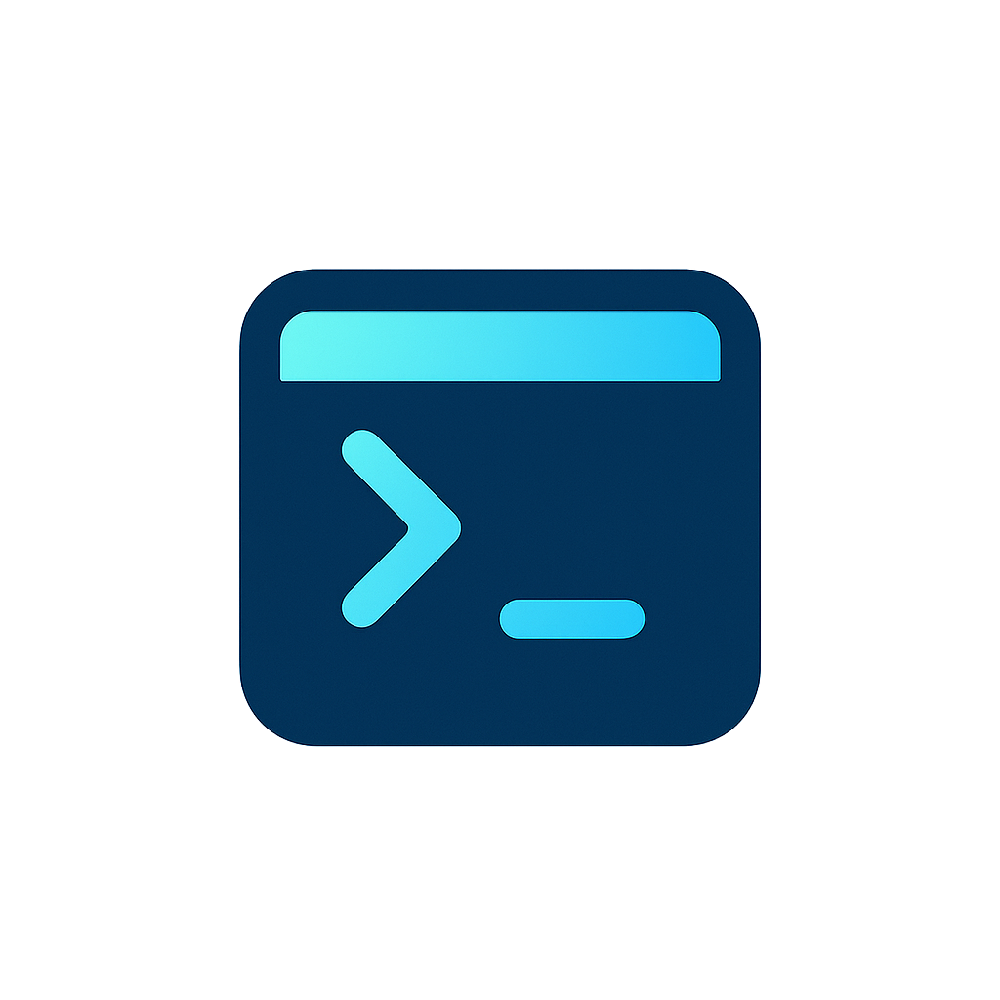
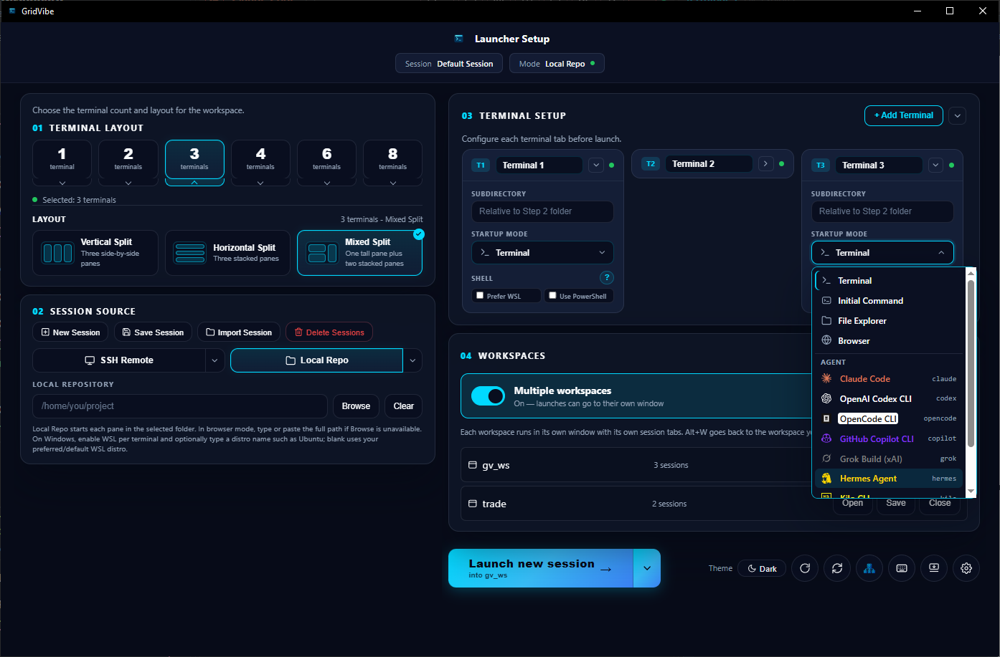
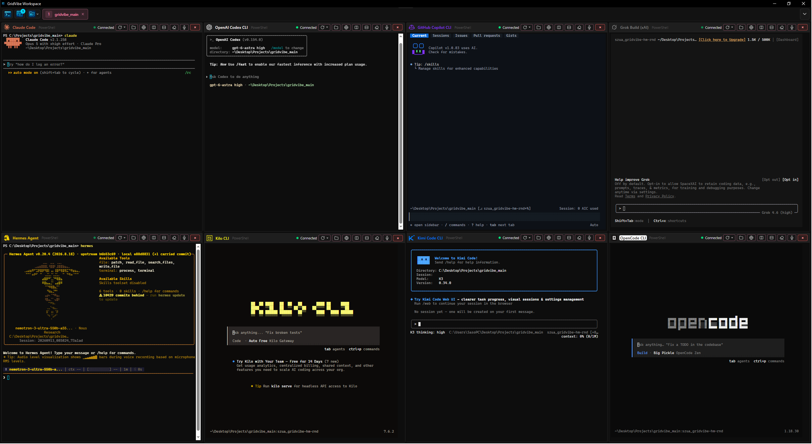
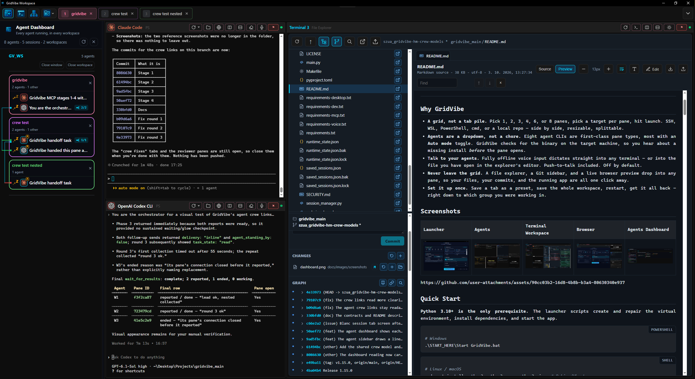
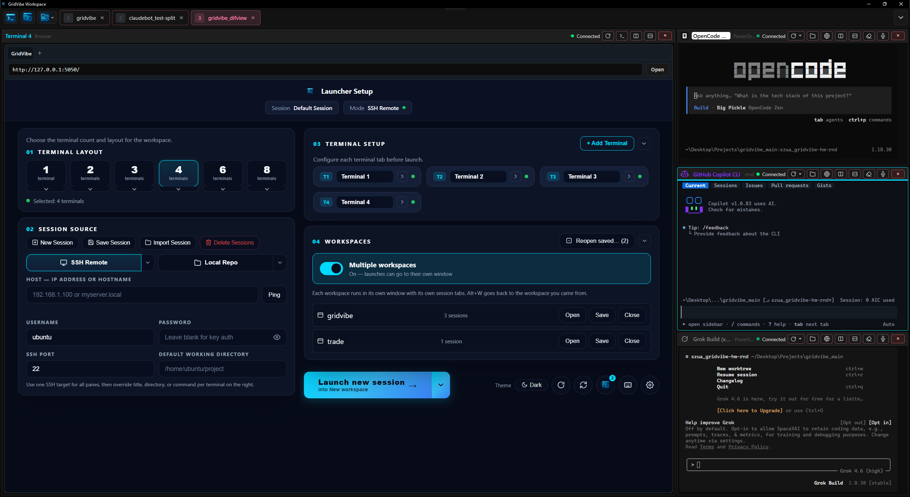
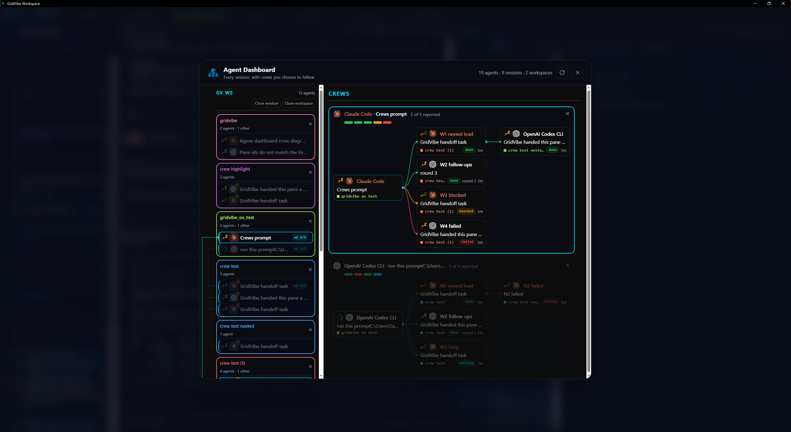

<h1 align="center">GridVibe</h1>

<p align="center">
  
</p>

<p align="center">
  <b>The vibe-coding cockpit.</b><br>
  Spin up a grid of AI agent CLIs and SSH terminals in seconds, talk to them out loud,<br>
  and keep your files, Git, and a live app preview in the same window.
</p>

<p align="center">
  <a href="https://github.com/JSstudent/gridvibe/actions/workflows/ci.yml"></a>
  
  
</p>

---

## Why GridVibe

- **A grid, not a tab pile.** Pick 1, 2, 3, 4, 6, or 8 panes and a target for each — SSH, WSL, PowerShell, cmd, or a local repo — side by side, resizable, splittable.
- **Agents are a dropdown, not a chore.** Eight agent CLIs are first-class pane types, and GridVibe tells you about a missing install *before* the pane opens.
- **Agents that build the grid.** Give an agent GridVibe's own tools and it can split panes, launch workers, hand them tasks, and collect their results.
- **SSH work that survives.** Run SSH panes inside tmux on the host, and a dropped connection or a restart no longer ends what they were running.
- **Talk to your agents.** Fully offline voice input dictates into any terminal or open file. Off by default.
- **Never leave the grid.** A file explorer, a Git sidebar, and a live browser preview drop into any pane.
- **Set it up once.** Save a tab as a preset, save the whole workspace, restart, and get it all back.

## Screenshots

| Launcher | Agents| Terminal Workspace | Browser | Agents Dashboard |
| --- | --- | --- | --- | --- |
|  |  |  |  |  |

https://github.com/user-attachments/assets/90cc03b2-16d8-4b8b-b3a4-80630340e937

## Quick Start

**Python 3.10+ is the only prerequisite.** The launcher scripts create the virtual environment, install dependencies, and start the app.

```powershell
# Windows
.\START_HERE\Start GridVibe.bat
```

```bash
# Linux / macOS
sudo apt install python3 python3-venv python3-pip   # Debian/Ubuntu
chmod +x GridVibe.sh && ./GridVibe.sh
```

```bash
# Manual, any platform
python -m venv .venv
source .venv/bin/activate        # Windows PowerShell: .venv\Scripts\Activate.ps1
python -m pip install --upgrade -r requirements.txt
python main.py                   # → http://localhost:5050
```

Both launchers ask for **Desktop** (native window, needs `requirements-desktop.txt`) or **Browser** mode. Later starts skip pip unless something changed; add `--repair` to the root launcher (`.\GridVibe.bat --repair` or `./GridVibe.sh --repair`) to force a full reinstall.

| | Get it | Update it |
| --- | --- | --- |
| **Clone** (recommended) | `git clone https://github.com/JSstudent/gridvibe.git` | The launcher's **Check for updates** button fast-forwards in place |
| **Release ZIP** (no Git) | **Source code (zip)** from [Releases](https://github.com/JSstudent/gridvibe/releases) | Download the next release |

A Windows installer that bundles Python is planned for **2.0.0**.

### Run modes

```bash
python main.py                     # browser mode on http://localhost:5050
python main.py --host 0.0.0.0      # bind all interfaces (opt-in)
python main.py --port 8080         # custom port
python webview_launcher.py         # auto: native window, browser fallback
python webview_launcher.py --mode browser|native
```

- **Native desktop mode** — the launcher and each workspace are real OS windows; **Minimize all** (`Alt+X`) sends them all to the taskbar.
- **Browser mode** — each workspace opens as a tab. Allow pop-ups for GridVibe's address so restoring several workspaces can open them all.

## Agent CLIs

Pick an agent per pane from the launcher's **Startup Mode** list. GridVibe checks for the binary **on the target** — the remote host, the WSL distro, or Windows — and shows install guidance when it is missing.

| Agent | Binary | Auto mode | GridVibe tools |
| --- | --- | --- | --- |
| Claude Code | `claude` | Yes | Yes |
| OpenAI Codex CLI | `codex` | Yes | Yes |
| GitHub Copilot CLI | `copilot` | Yes | Yes |
| OpenCode CLI | `opencode` | Yes | Yes |
| Kilo CLI | `kilo` | Yes | — |
| Kimi Code CLI | `kimi` | Yes | — |
| Grok Build (xAI) | `grok` | Yes | — |
| Hermes Agent | `hermes` | Yes | — |

GridVibe does not bundle the CLIs. If an agent shows `Missing`, install it and put its folder on `PATH` (for npm installs on Windows, usually `%APPDATA%\npm`), then restart GridVibe.

## GridVibe Tools (MCP)

Tick **MCP** beside an agent in the launcher, or press **MCP** on its row in a pane's 🔄 dropdown, and the agent can see and build GridVibe workspaces from inside its own pane. The tools need one optional package:

```bash
make mcp-deps     # or: python -m pip install --upgrade -r requirements-mcp.txt
make mcp-status   # names the broken link when an agent reports the server will not start
```

- **It knows where it is** — every workspace, session tab, pane and agent, which agent CLIs are installed, the saved presets, and which pane it is itself in.
- **It shapes the grid** — create workspaces, launch and split panes, resize dividers, relaunch a pane as another agent, Files or Browser, focus or move sessions, save a layout as a preset, and close finished work.
- **It runs a crew** — start Claude Code, Codex, Copilot or OpenCode workers with a task, send them follow-ups, and wait for their reports.
- **It asks first** — an agent only replaces, clears or closes panes it created. For anything else it puts GridVibe's own question to you, and chains of agents launching agents stop five deep.
- **Override mode** — tick **Override** beside **MCP** and, after a warning, the agent stops asking. Its MCP frame turns red.
- **Works over SSH** — an SSH pane gets the tools with nothing installed on the host, and its new panes open on that same host.
- **Stays out of your way** — an agent's splits and new tabs never steal your focus, and saved presets reach it without any credentials.

Ask, in the pane you are already in:

> *Split this pane stacked, run the dev server below me, and put a browser preview beside it on `http://localhost:3000`.*

> *Hand this to three Codex agents beside this one and wait for their results.*

Every tool, its gates and its limits: [`gridvibe_mcp/README.md`](gridvibe_mcp/README.md).

## SSH Sessions in tmux

*Experimental, off by default.* Turn on **App Settings ▸ Terminal ▸ Run SSH terminals in tmux** and an SSH terminal or agent pane can live in a tmux session on the remote host, so a dropped connection, a closed pane or a GridVibe restart no longer ends what it was running.

- **Launch into tmux** — tick **Run in tmux** on an SSH terminal or agent row. Type a session name to attach to it, or leave it blank for a new session named after the session tab.
- **Switch a live pane in or out** — the **tmux** button beside **Plain shell** in a pane's 🔄 dropdown moves it into a new tmux session or back to a plain shell. Its chevron lists the host's detached sessions to attach to.
- **Comes back on its own** — reconnect, workspace restore and a saved preset reattach the same session. Only the session is restored; what runs inside it is whatever tmux kept running.
- **Relaunch in a new window** — changing the pane's agent opens a new tmux window, and the session's other windows keep running.
- **Close means detach** — the session keeps running. Tick **Also end the tmux session** in the close dialog to end it.
- **Splits you make get their own session** — a split an agent asks for opens a plain shell, so nothing outlives GridVibe without your say.
- **Nothing typed into a session it found** — attaching never types a command; a startup command or agent only starts in a session or window GridVibe just created.
- **Your tmux, your config** — scrollback, mouse and key bindings follow your own `~/.tmux.conf`. A host without tmux gets a plain shell and a notice.

## Voice Input

Optional, fully offline, **off by default**. Turn it on in **App Settings**, pick a backend (`Vosk` or `faster-whisper`) and a language, and optionally a microphone and push-to-talk key.

- **In a terminal** — the 🎙️ button in any pane header.
- **In a file** — the explorer's editor has its own 🎙️; dictation lands at the caret and undoes in one `Ctrl+Z`.
- **Missing packages?** App Settings offers **Install voice dependencies**, or run `python -m pip install --upgrade -r requirements-voice.txt`.

Browser mode is the most reliable for microphone permissions. Details: [`docs/voice_guideline.md`](docs/voice_guideline.md).

## Sessions & Workspaces

- **Session tabs** — group related panes in draggable tabs. `Alt+1`–`Alt+9` switches, and broadcast typing sends your keystrokes to every pane in the tab.
- **Same for all** — tick it in the launcher's Terminal Setup and every terminal launches with Terminal 1's settings.
- **Saved presets** — save a setup and launch it again later. Stored SSH passwords are encrypted.
- **Save & restore** — GridVibe autosaves, and a restart brings back tabs, layouts, explorers and the active group, with each pane in the directory it was working in.
- **Resume agent conversations** *(experimental, off by default)* — with **App Settings ▸ Agents ▸ Resume agent conversations on restore** on, a restored Claude Code or Codex pane reopens the conversation it was in.
- **Multiple workspaces** — optionally keep projects in separate windows, move tabs between them without restarting terminals, and switch with `Alt+W`.
- **Close, restart & update** — one in-page choice: continue without saving, save every workspace, or save presets too. A failed save leaves the app open.

## Agent Dashboard

Every session in every workspace, agents first, in a sidebar docked beside your panes or a dialog you can park on a second screen (`Alt+A`).

- **State at a glance** — a spinning ring while an agent works, z's while it idles, a red dot when it is unreachable. The badge counts agents working right now.
- **One line per agent** — status, the agent's mark and its chat title, with where it runs one hover away. The agent you are typing into is ringed.
- **See the crews** — lanes show which agent handed work to whom and how each task is going, and a crew's diagram shows each worker's task.
- **Click to go there** — any row, session or crew node opens or focuses that window at that tab.
- **Fits your layout** — dock it left or right, widen it to twice its width, and each workspace remembers whether it is open.
- **Survives a restart** — restored crews come back as finished history, never as work in flight.

Panes running an agent rename themselves after it (`Terminal 1` → `Claude Code`), unless you typed a title. An agent you start by hand in a local pane is picked up within seconds; for WSL and SSH panes, launch it from the pane's 🔄 dropdown.

## File Explorer

Swap any pane between a terminal and a file explorer with one button, at the directory the terminal is in. Works on a local folder or a remote host over SFTP.

- **Browse & preview** — a Files tree with filter, file tabs, syntax-coloured source, rendered Markdown and Mermaid, images, and sandboxed HTML pages.
- **Edit in place** — any UTF-8 text file, saved atomically with `Ctrl+S` and protected against changes made on disk meanwhile.
- **Search the repo** — `Ctrl+Shift+F` with case, word, regex, file-pattern and `.gitignore` controls.
- **Manage files** — create, copy, move, rename, delete, upload and download (folders as ZIP), across a multi-selection. Nothing is ever overwritten, and every write stays inside the explorer root.
- **Stays current** — files changed by other programs show up on their own, and big files and diffs stay usable.
- **Restores with your workspace** — root, tabs, view, scroll, folds and zoom.

### Git sidebar

- **Status & history** — branch, staged and unstaged changes, and a searchable commit graph. Diff the working tree or any commit, with per-line undo.
- **Actions** — stage, unstage, commit, push and discard, each scoped to the whole repo, a pinned path, or whatever you are browsing.
- **Commit card** — right-click a commit for its full message, author, date, id and refs.

Checkout, pull, merge and cross-root transfers are left to the terminal.

## Switching a Pane's Shell or Agent

Click a terminal pane's 🔄 button to relaunch it in place — same slot, same title, same directory.

- **Pick a shell** — on Windows, Command Prompt, PowerShell, WSL or any detected distro.
- **Pick an agent** — each shell's chevron lists **Plain shell** and every agent, so "this pane, but Codex in WSL" is one click.
- **Add GridVibe tools** — the **MCP** and **Override** buttons beside an agent's row relaunch it with its tools.
- **In or out of tmux** — on an SSH pane, the **tmux** button beside **Plain shell** moves it into tmux or back out (see [SSH Sessions in tmux](#ssh-sessions-in-tmux)).
- **Update an agent** — the arrow beside its row runs the agent's own update command, then starts it.
- **A missing agent never touches your pane** — GridVibe checks the row's own target first and tells you instead of relaunching.

## Browser Preview

Flip a Local Repo pane to a browser preview (🌐) and watch the app you are building next to the terminal running it.

- **Tabbed** — up to 8 tabs that keep their own live frames, so switching never reloads your app.
- **Popups stay inside** — same-origin popups open as new tabs instead of escaping.
- **Saved with the workspace** — and with session presets.

Sites that block embedding need the **Open** button, which hands them to your own browser.

## Keyboard Shortcuts

The keyboard button in the workspace top bar and the launcher opens the full list in the app.

| Shortcut | Action |
| --- | --- |
| **Navigation** | |
| `Alt+1` – `Alt+9` | Switch session group |
| `Alt+W` / `Alt+Shift+W` | Next / previous workspace window (multiple workspaces only) |
| `Alt+W` | Return to the workspace that opened the launcher (on the launcher page) |
| `Alt+Q` | Open the launcher (in a workspace window) |
| `Alt+A` | Open the agent dashboard |
| **Terminal** | |
| `Ctrl+Shift+F` | Search the scrollback |
| `Ctrl+Shift+C` | Copy the selection |
| `Ctrl+V` | Paste into the pane |
| **Explorer** | |
| `Ctrl+F` | Find in the open file |
| `Ctrl+Shift+F` | Toggle repository search |
| `Ctrl+Shift+V` | Toggle the Markdown or HTML preview |
| `F5` | Refresh the focused explorer |
| `Enter` / `Shift+Enter` / `↑` / `↓` | Step through find matches (in any find bar) |
| `Esc` | Drop the selection, or close the open menu |
| **Editor** | |
| `Ctrl+Shift+E` | Edit the open file in place — and, while editing, cancel |
| `Ctrl+S` | Save |
| `Tab` | Indent |
| **Window** | |
| `Alt+X` | Minimize every GridVibe window (native window only) |

**Mouse:** `Alt`+click folds a whole level in the Files tree or collapses the Git graph; `Ctrl`/`Shift`+click extends the explorer selection; drag the dividers between panes to resize them. Voice push-to-talk is the one configurable chord.

## Icons

| Pane header | Does |
| :---: | --- |
| 🔄 | Reset the view; on a terminal, a dropdown to relaunch in another shell, agent, or tmux |
| 📁 ⇄ 💻 | Swap between terminal and file explorer |
| 🌐 ⇄ 💻 | Swap a Local Repo pane between terminal and browser preview |
| 🪟 | Split side-by-side or stacked |
| 🧹 | Clear the display and its replay buffer |
| 🎙️ | Start/stop voice input (when enabled) |
| 🌙 ⇄ ☀️ | Toggle an explorer pane between dark and light |
| ⋯ | Overflow menu on narrow panes |
| ✖️ | Close the pane |
| 🟢 | Connection status |

| Explorer bar | Does |
| :---: | --- |
| 🔄 | Refresh (`F5`) |
| ⬆️ | Parent directory |
| 🗂️ | Files tree |
| ⎇ | Git sidebar |
| 🔍 | Repository search |
| 📤 | Upload files |
| 🖥️ | Reveal in the system file manager (local panes) |

The session tab line holds the dashboard sidebar handle, the way back to the launcher, the dashboard dialog, and the GridVibe menu for saving and managing sessions and workspaces.

## Configuration

Everything lives in **App Settings**, from the gear on the launcher or any workspace: theme, terminal font, the Agents options, shell integration, SSH host-key policy, the experimental tmux and conversation-restore switches, autosave, and voice. On disk, settings load from `config.json` (git-ignored), falling back to `default_config.json`:

```json
{
  "server": { "host": "127.0.0.1", "port": 5050 },
  "appearance": { "theme": "dark" },
  "terminal": { "max_sessions": 16, "font_size": 14, "shell_integration": true },
  "workspace": { "surface_mode": "normal", "agent_sidebar_side": "left", "autosave_interval_minutes": 5, "multi_workspace_enabled": false, "minimize_cascade": false, "agent_conversation_restore": false },
  "ssh": { "host_key_policy": "auto-add", "tmux_sessions": false },
  "explorer_search": { "max_files": 2000, "max_matches": 5000, "timeout_seconds": 20 }
}
```

`terminal.shell_integration` (on by default) lets GridVibe follow the directory a terminal is *in*, so the explorer opens there. It adds an invisible marker to the shell prompt — and replaces cmd's `PROMPT` with `$P$G` plus that marker — so turn it off to leave every prompt untouched.

## Security

GridVibe is a local tool, not a public web service: it binds to `127.0.0.1` by default, has no built-in authentication, and should not be exposed to the internet.

- Cross-origin writes are rejected; set `security.cors_origins` only if you serve GridVibe from another origin.
- SSH host keys persist to `.known_hosts`, and `ssh.host_key_policy` can be `auto-add` (default), `known-hosts`, or `strict`. A changed key is always refused.
- Saved SSH passwords are encrypted with the key in `.encryption_key`.
- An SSH pane given GridVibe tools opens a token-protected port on the host's own loopback, only while that pane is connected.

See [`SECURITY.md`](SECURITY.md) for reporting and scope.

## Development

```bash
make check                      # test + lint
make test lint fix              # individually

# Windows without make:
python tests/run_tests.py
python -m ruff check .
```

More: [`CONTRIBUTING.md`](CONTRIBUTING.md) · [`CHANGELOG.md`](CHANGELOG.md) · [Engineering contracts](docs/engineering_contracts.md) · [`gridvibe_mcp/README.md`](gridvibe_mcp/README.md) · [`docs/session_state_guideline.md`](docs/session_state_guideline.md) · [`docs/voice_guideline.md`](docs/voice_guideline.md) · [`docs/logging_guide.md`](docs/logging_guide.md)

## Local Files

Created at runtime, never committed:

| File | Purpose |
| --- | --- |
| `config.json` | Local runtime configuration override |
| `saved_sessions.json` | Saved launcher presets (encrypted passwords) |
| `runtime_state.json` | Workspace snapshot for restore-after-restart |
| `.known_hosts` | Persisted SSH host keys |
| `.encryption_key` | Key for password encryption |
| `.gridvibe_mcp.json` | Generated MCP config, rewritten on every start |
| `.gridvibe_claude_settings.json` | Generated Claude Code hook for conversation restore, rewritten on every start |
| `logs/gridvibe.log` | Main rotating log file |

State files are written atomically with a `.bak` backup, and a damaged one is set aside and recovered from that backup.

## License

MIT. See [`LICENSE`](LICENSE).
