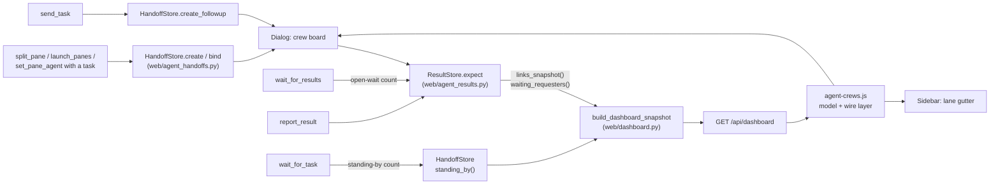

# Agent Crew Links: Implementation Plan

Show which agent handed a task to which, in the docked sidebar and the
dashboard dialog. Five stages, each one commit with its own changelog entry.
Stages 1 and 2 change nothing visible; stages 3 and 4 can land in either order
after them; stage 5 is independent of 3 and 4.

**The target appearance is
[`agent_crew_links_mockups.html`](agent_crew_links_mockups.html)**, the
reviewed proposals page. Open it in a browser before building stages 2–4.
Mockups **S3** (sidebar) and **D2** (dialog) are the chosen designs, and the
legend at the top of the page is the visual language for every link state. The
step bar plays one scenario through all five link states. S1, S2, D1 and D3 on
that page are rejected alternatives; build only S2's crew chip. The same page
is published privately at
<https://claude.ai/artifact/T7PGmS3BQmKhHDcRBaUcoP>. The local file is the
reference, because not every agent can open that link. [Appearance](#appearance)
below states the values to carry over.

This file is a working plan, not a contract: once a stage lands, its rules
move into `docs/engineering_contracts.md` and the stage's section here can be
deleted. Delete the mockup file with the plan.

Last checked against `ffa5797` (follow-up tasks: `send_task` /
`wait_for_task`). That commit changed no dashboard code. It did add a second
kind of waiting agent and a second way to bind a task, and it lets one pair of
panes run several rounds. The plan below accounts for all three.

## Decisions

| Area | Decision |
| --- | --- |
| Sidebar | Lane gutter: one wire per assignment down the left edge. The crew chip (`1/3`) goes on orchestrator rows. Hovering or focusing a row highlights its crew |
| Dialog | A crew board above the session list, which stays unchanged |
| Motion | A wire flows while its worker is working. It glows brighter while the orchestrator is waiting on it |
| Settled links | Fade to faint once collected. They stay until the orchestrator's pane closes, a follow-up supersedes them, or the store evicts them |
| Follow-ups | One wire per orchestrator–worker pair, across every round. A `send_task` round re-enters `handed` → `working` on the same wire; it is not a new wire |
| Round count | Each assignment carries its round: 1 for a task that started the agent, +1 per `send_task`. The board and the worker's hover show it from round 2 |
| Waiting agents | Two kinds wear the waiting mark: an orchestrator inside `wait_for_results`, and a worker standing by inside `wait_for_task`. Their words differ |
| Panes made without a task | No link. The `created_by_session_id` stamp is not drawn |
| Task label | Optional short label on a task, shown on the crew board only |

Out of scope: the nested rail (S1), the group-by-crew switch (D3), and
connectors on the dialog list (D1, a later follow-up that reuses stage 2).
Every live session stays listed exactly as today, with or without agents.

## Appearance

These values come from the mockup page. Its colours map one-to-one onto app
tokens: the page's `--accent` / `--ok` / `--warn` / `--bad` / `--faint` are
`--gv-accent` / `--gv-success` / `--gv-warning` / `--gv-danger` /
`--gv-dialog-muted`. Use the tokens, never the page's hex values. Where a
value below would fight an existing dashboard rule, the existing rule wins;
match the mockup's look, not its markup.

**Wires**, drawn from orchestrator to worker:

| Phase | Stroke | Width | Dash | Motion |
| --- | --- | --- | --- | --- |
| `handed` | accent at 60% opacity | 1.7 px | `2 4` | none |
| `working` | accent | 1.7 px, 2.1 px when awaited | `6 6` | dashes flow toward the worker, offset 12 → 0 over 0.9 s, linear |
| `working` + awaited | as above, plus `drop-shadow(0 0 3px accent at 70%)` | | | |
| `done` | success | 2 px | solid | a 3.2 px success dot with a matching glow runs worker → orchestrator: 2.4 s cycle, travelling for the first 55% and resting for the rest |
| `collected` | success at 45% opacity | 1.7 px | solid | none |
| `blocked` | warning | 2 px | solid | none |
| `failed` | danger | 2 px | solid | none |
| `ended` | muted | 1.7 px | `1 4` | none |
| dimmed (outside a highlighted crew) | any | | | whole wire at 14% opacity |

- Round caps and joins on every wire.
- A 2.6 px dot ends each wire: accent at the orchestrator end, and the
  phase's colour at the worker end.

**Sidebar lane gutter (S3):**

- About 18 px of extra left padding, only while links exist.
- A wire leaves the orchestrator row's card edge at the row's vertical centre,
  runs left to its lane, down the lane, and back right into the worker row's
  card edge.
- 4 px corner radius at both bends.
- The innermost lane sits 8 px left of the card edge, and each further lane
  5 px beyond that. Siblings from one orchestrator each get their own lane.
  The shortest spans sit nearest the cards, so ticks never cross a wire.
- Wires cross card and workspace boundaries freely.

**Crew chip (from S2):**

- Sits after the title, on orchestrator rows only.
- Mono 9.5 px / 600 weight, accent text on `--gv-accent-soft`, no border.
- Contents: a small fan glyph (a dot with three short strokes fanning right)
  plus `reported/total`, e.g. `1/3`.

**Highlight:** rows outside the crew drop to 0.32 opacity. Crew rows get an
inset 1.5 px ring of accent at 75%. The input-target ring is not dimmed.

**Waiting mark:** a 12 px ring, 2 px dotted accent border, a 6 px accent glow
at 35%, turning once every 3.2 s. Working stays the existing green ring
turning every 0.8 s, so the two never read alike.

**Crew board (D2):**

- **Section:** headed "Crews" in the band-heading style.
- **Crew box:** the panel-soft background, a 1 px hairline border, 12 px
  radius, and 10 px / 12 px / 14 px padding.
- **Header:** the orchestrator's mark, then "<Agent> · <line>" at 12.5 px /
  600, then "n of m reported" in muted 11.5 px. The segment bar sits flush
  right: one 22×6 px pill per link, 3 px apart, coloured by phase. `handed` is
  accent at 35%.
- **Grid:** 196 px per depth column, 52 px column gap, 8 px row gap. A parent
  is vertically centred on its children.
- **Nodes:** the dialog background, a 1 px hairline border, 9 px radius, and
  7 px / 9 px padding. The orchestrator node's border is accent at 45%.
  - Line one: state mark, agent mark, then the chat line, ellipsed.
  - Line two: a session chip (a 7 px square in the session hue plus the name
    in mono 10.5 px), a phase pill, and the age.
- **Pills:** mono 9.5 px / 600, fully rounded.
  - `handed`: accent text, dashed accent border.
  - `working`: accent on accent-soft.
  - `done` / `collected`: success on success-soft.
  - `blocked`: warning on warning-soft. `failed`: danger on danger-soft.
  - The orchestrator's "waiting on n": accent text, accent border at 40%.
- **Ghost node:** a dashed border at 65% opacity, plus a "pane closed" pill.
- **Wires:** an S-curve from the parent node's right edge to the child's left
  edge, with both control points at half the horizontal gap.
- **Below the board:** the session list, unchanged.

## Stages at a glance

| Stage | What lands | Main files | Visible |
| --- | --- | --- | --- |
| 1 | `links` and `waiting` in `GET /api/dashboard` | `web/agent_results.py`, `web/agent_handoffs.py`, `web/dashboard.py`; the four bind callers (`web/api.py`, `web/workspaces.py`, `web/session_shell.py`, `web/agent_followups.py`) | No |
| 2 | Shared crew model and wire layer | new `web/static/js/agent-crews.js`, `agent-dashboard.css` | No |
| 3 | Sidebar lane gutter, crew chip, highlight, waiting mark | `dashboard-sidebar.js`, `dashboard-dialog.js` (renderers), `agent-dashboard-sidebar.css` | Yes |
| 4 | Dialog crew board | `dashboard-dialog.js`, `agent-dashboard.css`, `partials/agent_dashboard_dialog.html` | Yes |
| 5 | Optional `task_label` | `gridvibe_mcp/server.py`, `web/agent_handoffs.py`, `web/agent_followups.py`, the four task routes | Board only |

## Stage 1: Links in the dashboard payload

### 1a. `ResultStore.links_snapshot()`

A read under the store's own lock (`_changed`) that returns one plain dict per
assignment, oldest-handed first (the store's insertion order, as `collect()`
returns rows). It is built from an explicit field tuple, `LINK_FIELDS`, the
same way `PANE_FIELDS` is in `web/dashboard.py`, so a field added to
`_Assignment` later cannot leak.

Since `ffa5797`, one pair of panes can hold **two** assignments at once.
`send_task` requires the last one to be `reported` but not `collected`, so an
uncollected report and the next round's working assignment can coexist.
`expect()` deletes a superseded assignment only once it is settled **and**
collected. The snapshot returns both, and the crew model collapses them (stage
2).

| Field | Source | Note |
| --- | --- | --- |
| `link_id` | new, minted in `expect()` | Opaque, `secrets.token_hex(8)`. Never the `handoff_id`, which is a capability for `take`. A new one is minted each follow-up round, so it identifies an assignment, not a wire |
| `requester_session_id` | `_Assignment` | |
| `worker_session_id` | `_Assignment` | |
| `state` | `_Assignment` | `working` / `reported` / `ended` |
| `read` | `_Assignment` | Whether the worker fetched its task |
| `status` | `_Assignment` | `done` / `failed` / `blocked`, or empty |
| `collected` | `_Assignment` | |
| `handed_at`, `reported_at` | `_Assignment` | ISO strings, already stored |
| `reason` | `_Assignment` | The end-reason key, never the requester-facing sentence. `ffa5797` added `agent exited` and `agent replaced` |
| `round` | new `_Assignment.round`, set in `expect()` | 1-based. See [the round count](#the-round-count) |
| `worker_agent` | new, captured at bind | `agent_selection` / `custom_agent` / `group_id` of the worker when it was bound. The board uses it to draw a closed worker's mark and session hue |

The snapshot never carries `text`, `receipt` or `handoff_id`. Add those three
to a test that fails if they ever appear.

`worker_agent` comes from the worker's session record, passed down as a small
frozen mapping so neither store imports from the rest of `web/`. Every way a
task is bound ends in `HandoffStore._bind_locked()`, which calls `expect()`.
So `_bind_locked()` takes the mapping and forwards it, and each of the four
entry points supplies it from the session record it already holds:

| Path | Store call | Caller |
| --- | --- | --- |
| split | `bind(handoff_id, session_id)` | `web/api.py` split route |
| launch | `create(..., session_id=)` | `web/workspaces.py` |
| relaunch | `create(..., session_id=)` in `before_start` | `web/session_shell.py` `_with_task_binding` |
| follow-up | `create_followup(...)` | `web/agent_followups.py` `hand_followup_task` (the worker record is already fetched in `_check_followup`) |

On the relaunch path, binding runs in `before_start`. Confirm that the session
record already carries the new `agent_selection` by then. If it does not,
capture the target agent from the relaunch request instead.

#### The round count

A round counts tasks handed to **the same running agent**, so only a follow-up
advances it. A `set_pane_agent` task from the same requester starts a fresh
agent and is round 1 again, like a split or a launch.

- `expect()` gains `continues: str = ""`, the handoff id of the round being
  followed up. Only `create_followup()` passes it, through `_bind_locked()`;
  the other three paths leave it empty.
- `expect()` reads the continued assignment's `round` **before** its
  supersede loop, because that loop deletes the continued round when it was
  collected. The new round is that value + 1.
- The continued record is still there at that point. `_bind_locked()` first
  ends the previous handoff as `replaced`, but `ResultStore.end()` leaves a
  reported assignment in place and only stops it taking reports. The one
  exception is eviction at `MAX_ASSIGNMENTS`. If the record is gone, fall back
  to round 2: a follow-up is never round 1.
- The count lives only in memory, like the rest of the store. It is not
  persisted and never logged.

### 1b. The waiting reading

`wait_until_settled()` increments a per-requester open-wait counter on entry
and decrements it in `finally`, under the same condition lock, and stamps the
monotonic end time. `waiting_requesters(now)` returns the requesters with an
open wait, plus those whose last wait ended within `WAIT_GRACE_SECONDS`
(start at 5 s).

The grace exists because `wait_for_results` is a loop of calls of up to 55 s
each (`MAX_WAIT_SECONDS`), so there is a short gap between one call and the
next. Without the grace, the waiting mark would flicker in that gap. Pin the
constant by test, like the other timing constants in this module.

Both ways a requester waits pass through `wait_until_settled()`. One is the
route in `web/api.py`. The other is the tunnelled in-process client in
`web/mcp_http.py`, which waits there and then reads the route with `wait=0`.
Count only calls with a timeout above zero. Otherwise that `wait=0` read, or
an agent polling with `wait=0`, would restart the grace window.

**Standing by.** `wait_for_task` is the same loop on the worker side, and it
already keeps a per-pane count: `HandoffStore._task_waiters`, under the
handoff store's condition. Add the same end stamp there, and a
`standing_by(now)` reading with the same grace (reuse `WAIT_GRACE_SECONDS`).
Leave `awaiting_task()` exact and graceless, because `send_task` uses it to
tell the sender whether the agent is in a call **now**.

The handoff store's lock sits above the results lock, because
`wait_for_next_task` calls `live_assignment()` while holding it. The dashboard
reads each store on its own and never holds one store's lock inside the
other's.

### 1c. Composing it

- `build_dashboard_snapshot()` reads `links_snapshot()`,
  `waiting_requesters()` and `standing_by()` **after** it releases
  `session_manager.lock`. Neither store's lock is ever held together with the
  manager lock or `connection_lock`.
- `compose_dashboard()` stays pure and gains `links`, `waiting` and
  `standing_by` keyword arguments. Its output gains:
  - a top-level `links` list, holding only links whose requester is a composed
    agent pane. A worker that has no row (closed, or no longer an agent) keeps
    its link, because the board draws it as a ghost;
  - `pane["waiting"]`: `"crew"` on a requester in `waiting`, `"task"` on a pane
    in `standing_by`, and `""` everywhere else. A pane that is both an
    orchestrator and a worker makes one tool call at a time, so both readings
    overlap only inside the grace window. In that case `"crew"` wins.
- **Waiting overrides activity, after transport.** The state key becomes:
  not connected → transport word; any `waiting` → `waiting`; otherwise the
  activity reading. `is_working_pane()` applies the same override, so a
  waiting orchestrator or a standing-by worker never counts in
  `totals.working`, and the badge stays a tally of the marks. That matters
  more after `ffa5797`: a worker told to stand by sits inside `wait_for_task`
  between rounds, which an agent CLI may show as a running tool call.
- `links` is outside `workspaces`, so it never enters the row structure key.

## Stage 2: Shared crew model and wire layer

A new `web/static/js/agent-crews.js`, using the same UMD factory shape as
`dashboard-sidebar.js` so Node tests can load it. Include it after
`session-colour.js` and `agent-identity.js`, and before `dashboard-dialog.js`,
on **both** `templates/terminals.html` and `templates/index.html`.

**Pure part**, tested in Node without a DOM:

- `indexCrews(snapshot)` returns `{ byRequester, byWorker, rootOf, roots }`.
  Every crew is a tree rooted at a requester that is not itself a worker. The
  store does not guarantee a tree, so the index makes one:
  - **One edge per pair.** Links are collapsed by
    `(requester_session_id, worker_session_id)`, and the last one in snapshot
    order wins. That is the current round. An older uncollected round is not
    drawn, but stays in the reading until the requester collects it.
  - **One parent per worker.** A worker is placed under the requester of its
    newest link. A settled link to an earlier requester (a pane re-tasked by
    someone else with `set_pane_agent`) is left out of the tree.
  - **No cycles.** `set_pane_agent` can hand a task back to the pane that
    asked, which makes a loop. Break it at the earliest-handed link in the
    loop, so the index always terminates.
  - Wires, nodes and DOM keys use the pair (or the worker id), never
    `link_id`, so a new round never rebuilds a wire or a node.
- `linkPhase(link)` is the one place the drawn state is decided:

  | Phase | Condition |
  | --- | --- |
  | `handed` | `state == working` and not `read` |
  | `working` | `state == working` and `read` |
  | `done` / `failed` / `blocked` | `state == reported`, not `collected`, by `status` |
  | `collected` | `state == reported` and `collected` (blocked/failed keep their colour, faint) |
  | `ended` | `state == ended` |

  A follow-up round goes from `collected` back to `handed`, then `working`, on
  the same wire. That is not a new state, and the mockup's five states cover
  it.

- `crewSummary(requesterId)` returns `{ total, reported }` for the chip,
  counted per worker (each pair's current round), not per assignment.
- `assignLanes(spans)` is a greedy interval packing, shortest span nearest the
  cards. Past `MAX_LANES = 4` it returns a single trunk.
- `wirePath(mode, from, to, lane)` builds the path string for `lane` and `fan`.

**DOM part:** `createWireLayer({ container, mode })` returns
`{ paint(snapshot), highlight(crewId), dispose() }`.

- One `<svg class="dash-wires">` inside the scrolling content, so scrolling
  needs no repaint.
- It measures only the rows that are link endpoints, found by `data-session-id`.
- It repaints after every tree paint or in-place update, and on a
  `ResizeObserver` of the container (which covers the sidebar drag).
- Wires are a decoration layer: a link changing phase rewrites the SVG and
  never touches a row, so scroll, focus and the input-target ring stay put.
- `aria-hidden="true"` on the SVG. The crew is stated in text on the rows (the
  chip and the hover), so colour and motion are never the only signal.

**CSS** goes in `agent-dashboard.css` and uses tokens only: `--gv-accent`,
`--gv-success`, `--gv-warning`, `--gv-danger`, `--gv-dialog-muted`. There is
no new palette, because session hues already use the whole wheel.

- `working`: dashed and flowing, via a `stroke-dashoffset` animation.
- `.is-awaited`: thicker, plus a `drop-shadow` glow.
- `done`: a pulse that runs back to the orchestrator, via `<animateMotion>`.
- Under `prefers-reduced-motion: reduce`, nothing moves and the pulse is not
  drawn.
- A `.dash-wires-paused` class sets `animation-play-state: paused`. Set it
  wherever the poll is suspended for a hidden document.

The new waiting mark is `.dash-state-waiting .dash-state-dot`: a dotted
`--gv-accent` ring turning slowly. It fits the existing 16×14 slot and reduced
motion holds it still. The word stays out of flow so the row's accessible name
states it: "Waiting on its crew" for `waiting == "crew"`, and "Standing by for
its next task" for `"task"`. Both use one mark, which the mockup draws only
for the orchestrator.

## Stage 3: Sidebar

- **Gutter only when needed.** When `snapshot.links` is non-empty, add
  `has-crews` to the panel. It adds about 18 px of left padding inside the
  scroller. With no links, the width is exactly today's.
- **Wires.** A `createWireLayer({ mode: 'lane' })` per sidebar instance,
  painted at the end of `refresh()` and after `paint()`. A link whose worker
  has no row draws no wire; the chip still counts it.
- **Crew chip.** `dashboardCrewChipHtml(pane, crews)` lives in
  `dashboard-dialog.js` and is handed to the sidebar through the runtime,
  beside `mcp`, like every other field the two surfaces share. It renders in
  its own `.dash-agent-crew` slot and updates in place, so a report never
  rebuilds the row. Its hover names the count in words ("Handed tasks to 3
  agents; 1 reported").
- **Worker hover.** A worker row's `title` gains one line: "Working for
  <orchestrator agent> · <its chat line>", followed by " · round n" from round
  2. This goes through the existing `render.hover` path.
- **Highlight.** `pointerover` / `focusin` on a crew row calls
  `layer.highlight(root)`. The panel gets `is-crew-highlight`, rows outside the
  crew dim to 0.32 (see [Appearance](#appearance)), and wires outside the crew
  dim. `pointerleave` /
  `focusout` from the panel clear it. The input-target ring stays at full
  strength on a dimmed row.
- **Waiting mark** comes from `dashboardActivityHtml()` through the state-key
  override, and is updated in place like any reading. That covers orchestrators
  and standing-by workers.

## Stage 4: Dialog crew board

- `dashboardCrewBoardHtml(snapshot, crews)` renders a "Crews" section at the
  top of the dialog body, only while at least one crew exists. The session
  list below it is untouched.
- **Layout:** one `.dash-crew` per root, in the order its orchestrator
  appears in the list. Inside, a CSS grid with one column per depth (196 px).
  Each leaf takes a row, and a parent spans its children's rows. The board
  scrolls sideways inside itself, so the dialog never overflows.
- **Crew header:** the orchestrator's mark and chat line, "n of m reported",
  and a segment bar with one segment per worker (its current round), coloured
  by `linkPhase`.
- **Nodes:**
  - Each live node is a button with `data-dashboard-action="pane"` and the
    same target attributes as a row, so it lands on its pane through
    `openDashboardTarget`.
  - Contents: state mark, agent mark, chat line, session chip (hue from
    `session-colour.js`), a phase pill, and an age from `handed_at` /
    `reported_at`.
  - From round 2, "round n" sits between the phase pill and the age, in the
    age's muted style. It is not a pill, and the mockup has no slot for it.
    Like the age, it updates in place and is not part of the structure key.
  - A ghost (the worker has no row) is a non-interactive `div` drawn from
    `worker_agent`, reading "Pane closed" plus its phase.
- **Wires:** a second `createWireLayer({ mode: 'fan' })` scoped to the board.
- **Repaint:** the board has its own structure key (crew membership by pair,
  node liveness, phase). It never includes `link_id`, which changes every
  round. Titles, readings and ages update in place, as the rows do
  today. A change of phase only repaints that node's pill and the board's SVG.
- **Narrow width:** under the dialog's existing container width, the grid
  collapses to one column with indentation. Fan wires become `lane` wires.

## Stage 5: Optional task label

- **Tool surface:** an optional `task_label` argument on `split_pane`,
  `set_pane_agent`, `send_task`, and each pane of `launch_panes`.
  - Allowed only alongside `task`.
  - One line, printable, at most `MAX_TASK_LABEL_CHARS = 60` characters.
    Refused, never truncated, the same way `validate_task` refuses.
  - Its description says it is **shown to the person on the dashboard**,
    unlike the task text.
- **Validation:** the sidecar uses the same `_task`-style guard. On the web
  side, add `validate_task_label()` in `web/agent_handoffs.py`, called beside
  `validate_task()` at all four entry points: `web/api.py` (split),
  `web/workspaces.py` (launch), `web/session_shell.py` (relaunch) and
  `web/agent_followups.py` `hand_followup_task` (follow-up). Validate it before
  the follow-up rules, as the task is, so a bad label is refused for what it
  is.
- **Plumbing:** `HandoffStore.create(label=…)` and
  `HandoffStore.create_followup(label=…)` → `_bind_locked` →
  `ResultStore.expect(label=…)` → `LINK_FIELDS` gains `label`.
- **Rounds:** the label belongs to one round. A `send_task` without a label
  leaves the new round unlabelled, and the node falls back to the chat line.
  It never inherits the previous round's label, which described a different
  task.
- **Logging:** log lines gain the label's character count only, keeping the
  "never logged in full" rule of both stores.
- **Display:** the board shows the label as a node's line. With no label, it
  shows the pane's chat line. Nothing else displays it.
- Update the tool table and the task section of `gridvibe_mcp/README.md`, and
  re-run `make mcp-tools` to confirm the surface.

## Tests

Run the focused modules per stage, then `ruff check .`. Stage 5 touches the
tool surface across processes, so run the full suite (`make check`) for that
stage only.

| Stage | Tests |
| --- | --- |
| 1 | `tests/test_agent_results.py`: snapshot fields; no text, receipt or handoff id at any depth; `link_id` stable across reads; open-wait counter and grace window; a `wait=0` call does not open the grace window; an uncollected round and its follow-up both listed; `round` is 1 without `continues`, +1 with it, still +1 when the continued round was collected (and so deleted by the same call), and 2 when the continued record was evicted. `tests/test_agent_followups.py`: `standing_by()` count and grace, while `awaiting_task()` stays exact; `worker_agent` captured on a follow-up; three `send_task` rounds read rounds 1–3; a `set_pane_agent` task from the same requester after that reads round 1. `tests/test_dashboard.py`: `links` composed and filtered to agent requesters; `waiting` is `crew` / `task` / `""`, and `crew` wins on overlap; neither kind counted in `totals.working`; `links` outside the structure. `tests/test_agent_handoff_routes.py`: `worker_agent` captured on split, launch and relaunch |
| 2 | New `tests/test_agent_crews.py`, run in Node: `indexCrews` trees and nesting, one edge per pair (newest wins), one parent per worker, a cycle broken and the index terminating; `linkPhase` truth table; `crewSummary` per worker; `assignLanes` packing and the trunk past four lanes. Source assertions only for the reduced-motion rule and the token names |
| 3 | `tests/test_dashboard_sidebar.py` (Node harness): `has-crews` toggles the gutter; the chip comes from the dialog's builder; an in-place chip update leaves the row element the same; highlight classes; the input-target ring survives a dim |
| 4 | `tests/test_dashboard_dialog.py`: board absent with no links; node order and grid spans for a nested crew; ghost node from `worker_agent` is not a button; a phase change keeps the node elements; a follow-up round (new `link_id`, same pair) keeps the node elements and updates "round n" in place; no round text at round 1; nodes carry the row's target attributes. `tests/test_dashboard_targeting.py`: a node click lands on the pane |
| 5 | `tests/test_mcp_tools.py`, `tests/test_mcp_handoff.py`: argument schema (including `send_task`), label without task refused, length and control-character refusals in both processes. Route tests for all four entry points, including `tests/test_agent_followups.py` for a follow-up's label and its non-inheritance |

## Docs and changelog

- `docs/engineering_contracts.md`, Agent dashboard section:
  - the `links` payload and its field list;
  - the waiting override (both `crew` and `task`) and its effect on
    `totals.working`;
  - one wire per pair across follow-up rounds, and how the crew tree is made;
  - the round count: only a follow-up advances it, and it is read before the
    superseded round is dropped;
  - the wire layer as a decoration that never rebuilds rows;
  - the gutter only while links exist;
  - the board's own structure key and ghost nodes.
- `docs/engineering_contracts.md`, Agent tools (MCP) section: `task_label` is
  published, unlike the task text, and a follow-up's label is its own.
- `gridvibe_mcp/README.md`: `task_label` in the tool table, the task section,
  and "Following up with the same agent".
- `README.md`: one bullet under the Agent Dashboard section per surface, held
  to the README rules.
- `CHANGELOG.md`: one entry per commit, at the top of `## Unreleased`. Use
  these headlines, which are also the commit subjects:

  1. `(other) The dashboard reading now carries which agent handed a task to which.`
  2. `(other) Add the shared crew model and wire layer for the agent dashboard.`
  3. `(feat) The agent sidebar draws a line from each orchestrator to the agents it handed tasks to.`
  4. `(feat) The agent dashboard shows each crew of agents as a board with its progress.`
  5. `(feat) An agent can give a task a short label that the dashboard shows.`

## Risks and open questions

- **Measurement cost.** The layer measures only endpoint rows, once per paint.
  With many crews in a long sidebar, check that a 4 s poll with an unchanged
  tree does no layout work beyond those rows.
- **Store eviction.** At 256 assignments (`MAX_ASSIGNMENTS`) the oldest
  settled ones are evicted and their wires disappear without notice. That is
  acceptable; nothing to do unless it shows up in practice. Follow-up rounds
  do not add to the pressure once collected, because `expect()` drops the
  collected round it supersedes.
- **A worker's agent exits.** Since `ffa5797`, a task goes with the agent it
  was announced to. An agent that exits, or is swapped at the same shell,
  ends its assignment (`agent exited` / `agent replaced`). The wire turns
  `ended` while the pane row stays. That is correct, but it reads differently
  from a closed pane (ghost), so the board's `ended` pill should name the
  reason in its hover.
- **Restart drops links.** Links live in memory, like the results store.
  Restored panes come back without them.
- **Cross-window.** Each window draws its own layer from its own read, so
  there is no shared state to keep in step.
- **Open: label length.** 60 characters is a guess sized to one board line.
  Confirm before stage 5.
- **Open: worker identity capture.** Stage 1 records the worker's agent and
  group at bind time, for ghosts. If a worker is later moved to another
  session, its ghost shows the old session hue. That seems acceptable for a
  closed pane, but it is a choice.