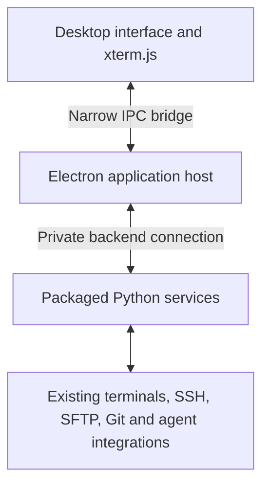

# GridVibe desktop transition: framework alternatives

**Date:** 6 October 2026  
**Status:** Research and recommendation; no framework selected or migration implemented.  
**Related analysis:** [PySide6 transition whitepaper](pyside6_transition_whitepaper.md).

## Recommendation

For the broader goal of making GridVibe a polished standalone application, **shortlist Electron and Tauri ahead of a fully native PySide6 rewrite**. Both allow GridVibe to retain xterm.js and much of its existing interface while gaining a desktop application host and distribution workflow.

The PySide6 whitepaper evaluated a native-widget transition. Its findings expose migration costs, rather than establish that GridVibe's current architecture is fundamentally wrong. SSH ownership, save consistency, terminal replies and agent integration would remain concerns under any framework.

The proposed direction is **desktop-first GridVibe, retaining xterm.js and the Python backend initially**. Electron is the current preference for reducing migration risk; Tauri is the alternative to validate if distribution footprint and a future Rust direction carry more weight. These are project-specific judgments, not benchmark results.

## What the framework supplies

Tauri and Electron supply the desktop application framework. Terminal functionality still needs two components:

- **Rendering and emulation:** interpreting terminal output, maintaining its screen and modes, and handling keyboard, selection and scrolling. GridVibe already uses xterm.js, which also powers VS Code's integrated terminal. [xterm.js](https://xtermjs.org/)
- **Transport and process ownership:** starting and controlling local PTY/ConPTY sessions or remote SSH channels, moving input/output, resizing and shutting down resources. GridVibe already implements these responsibilities in Python.

Retaining both initially avoids making terminal replacement a prerequisite for desktop packaging and rebranding. Neither Tauri nor Electron implies native widgets: both render the main interface using web technology. Their value here is application integration, lifecycle, packaging and controlled communication with backend services.

## Options at a glance

| Option | Terminal approach | Existing code reuse | Main tradeoff | Assessment |
| --- | --- | --- | --- | --- |
| **Electron + Python backend** | Existing xterm.js and Python PTY/SSH transports | High | Ships Chromium, Node and a Python runtime | Strongest practical fit |
| **Tauri + Python sidecar** | Existing xterm.js and Python transports | High | Adds a Rust host and platform webview differences | Strong contender |
| **Tauri + Rust backend** | xterm.js with Rust PTY/SSH services | High frontend reuse; substantial backend rewrite | Greater migration scope | Possible long-term direction |
| **PySide6 + embedded xterm.js** | WebEngine terminal within native Qt controls | Backend reuse; substantial UI replacement | Two UI technologies and retained browser engine | Good if native widgets are essential |
| **Build on an existing terminal application** | Inherit its terminal stack | Reuse its application and port GridVibe features | Adapting to another product's architecture | Worth studying, higher commitment |

“High reuse” means retaining substantial behavior and implementation, not dropping the current application into a new host without changes. Template bootstrapping, native bridge calls, window ownership, asset loading and backend communication still require adaptation.

## Electron with the existing Python backend

Electron supplies a desktop main process, Chromium rendering, native window integration and inter-process communication (IPC). Its distribution guidance covers packaging, signing and updates. This gives GridVibe a supported place to own application lifetime, windows and installation. [Electron process model](https://www.electronjs.org/docs/latest/tutorial/process-model), [distribution guidance](https://www.electronjs.org/docs/latest/tutorial/distribution-overview)

The proposed architecture is:

The backend connection could initially retain the existing loopback HTTP/Socket.IO adapter. A later stage could use private IPC after extracting application services. The diagram describes the target ownership boundary, not a transport already implemented.

### Advantages for GridVibe

- Retain most frontend behavior initially and redesign its appearance progressively.
- Preserve xterm.js, explorer rendering, browser-oriented previews and existing JavaScript interaction policies.
- Package Python so users do not install or maintain it themselves.
- Use one shipped browser-engine version per application release, reducing rendering variability between platforms.
- Give desktop windows, menus and application lifetime a dedicated owner outside the page.

Electron also has a mature terminal transport option in **node-pty**, supporting Windows, macOS and Linux. GridVibe need not adopt it immediately: changing the application host does not require simultaneously replacing existing terminal and SSH logic. It would be a separate migration candidate if moving services into Node later. [Microsoft node-pty](https://github.com/microsoft/node-pty)

### Costs and limits

Shipping Chromium, Node and Python produces a comparatively substantial installation. Memory and startup must be measured using the whole process tree. Electron also adds its own dependency updates and packaging work.

The privileged main process and backend APIs must remain separate from untrusted browser-preview content. Use narrowly exposed application methods rather than exposing Node or arbitrary backend commands to pages. [Electron security guidance](https://www.electronjs.org/docs/latest/tutorial/security)

**Assessment:** the strongest default when preserving current functionality and reaching a dependable desktop release matter more than minimizing installer size.

## Tauri with a Python sidecar

Tauri uses a Rust host and the operating system's webview. Windows uses WebView2; other platforms use different webview engines. Tauri can bundle external executables, including packaged Python applications, as sidecars. [Tauri architecture](https://v2.tauri.app/concept/architecture/), [webview versions](https://v2.tauri.app/reference/webview-versions/), [sidecar support](https://v2.tauri.app/develop/sidecar/)

A sensible GridVibe design would keep Python as the service sidecar and limit Rust initially to application integration, lifecycle and communication. Tauri commands and streaming channels could carry operations and terminal output through a controlled bridge. The sidecar-to-Rust protocol would still need a design and implementation. [Tauri commands and channels](https://v2.tauri.app/develop/calling-rust/)

### Advantages for GridVibe

- Preserve xterm.js and existing HTML/CSS/JavaScript.
- Gain desktop windows and distribution facilities, including Windows installers and an updater.
- Avoid bundling a complete Chromium distribution with the application.
- Leave open the option of moving selected services to Rust later.

Tauri provides dedicated [Windows installer](https://v2.tauri.app/distribute/windows-installer/) and [updater](https://v2.tauri.app/plugin/updater/) facilities.

### Costs and limits

- The project would maintain JavaScript, Rust and Python.
- Python and its dependencies still contribute to package size. Small examples of pure Tauri applications are not useful estimates for GridVibe's final distribution.
- Rendering, microphone behavior and browser content need testing across different platform webview engines.
- Removing Flask from desktop operations still requires backend separation. Tauri does not convert existing request handlers into independent services.
- Terminal streaming needs batching, ordering, bounded queues and backpressure regardless of the bridge.
- Sidecar startup, failure reporting, shutdown and packaging must work on each supported OS and architecture.

**Assessment:** a good candidate if distribution overhead and adopting Rust are meaningful priorities. Compare it with Electron using actual GridVibe workloads before making footprint or responsiveness claims.

## A complete Rust backend as a later option

Tauri does not require rewriting the backend in Rust. If removing Python later becomes an explicit goal, Rust has building blocks such as WezTerm's `portable-pty`. That handles pseudoterminals; xterm.js would still render the terminal. [portable-pty](https://docs.rs/portable-pty/latest/portable_pty/)

SSH, SFTP, configuration, state transactions, process bounds, agent policies, MCP and voice integration would each need their own migration. A PTY library does not replace those services.

Removing Python is a separate investment from making GridVibe feel standalone. Combining a GUI-host transition, full backend rewrite and rebrand would increase the number of behaviors changing at once. Revisit Rust service ownership after a packaged desktop version establishes a baseline and identifies concrete maintenance or performance problems.

## PySide6 with embedded xterm.js

A native Qt shell can retain xterm.js through Qt WebEngine while implementing menus, settings, workspace navigation and other controls as widgets. This avoids building a native terminal renderer, but still requires substantial interface replacement and maintains both native and web presentation technologies.

It remains appropriate if native widgets are a firm product requirement. It is less attractive if the primary goal is installation, coherent branding and predictable application behavior with maximum reuse. The [PySide6 whitepaper](pyside6_transition_whitepaper.md) examines this route, its terminal boundary and web-content isolation requirements in detail.

## Existing terminal applications as references or foundations

Two relevant projects already demonstrate desktop architectures close to GridVibe's problem space:

| Project | Why it is relevant | How to evaluate it |
| --- | --- | --- |
| **Wave Terminal** | Terminal workspace with graphical content, remote workflows and AI integration; its repository combines Electron frontend infrastructure with a Go backend | Study desktop/backend separation and workspace interaction. Evaluate feature and architecture fit before considering a fork. |
| **Tabby** | Electron-based terminal application with local terminals, SSH and a plugin architecture | Assess whether its extension points can express GridVibe's workspace and agent behavior without maintaining a large fork. |

Primary sources: [Wave Terminal repository](https://github.com/wavetermdev/waveterm), [Tabby repository](https://github.com/Eugeny/tabby).

These projects are useful architectural references. Adopting one as a foundation would require evaluating GridVibe's layout, MCP, agent orchestration, explorer and state semantics against its existing abstractions. A fork also creates ongoing upstream integration and dependency-license review work. Existing terminal functionality alone is not sufficient evidence that porting the rest of GridVibe would be cheaper.

## Suggested transition sequence

1. **Compare desktop hosts.** Build small Electron and Tauri prototypes against the same representative GridVibe workspace and backend. Preserve terminal behavior while testing host integration.
2. **Establish a standalone distribution.** Package Python, manage backend startup/shutdown, create application shortcuts, separate user data from installation resources, and produce a clean-machine installer.
3. **Move application ownership into the host.** Implement window identity, close/save coordination, focus and native menus with explicit frontend/backend interfaces.
4. **Redesign and rebrand progressively.** Retain proven terminal and domain behavior while improving navigation, layout, settings and visual consistency.
5. **Extract backend services and evaluate IPC.** Remove HTTP dependencies from desktop actions where this simplifies ownership. Retain integration endpoints needed by external consumers until replacements are proven.
6. **Reassess backend language and legacy browser support.** Make these separate decisions based on measured cost and product needs.

MCP consumers are a reason to keep transport decisions explicit. Current local sidecars and remote integrations have established startup, identity and HTTP behavior; moving the desktop UI to IPC does not remove their requirements. The [MCP reference](../gridvibe_mcp/README.md) remains the source for that surface.

The [engineering contracts](engineering_contracts.md) and [state guide](session_state_guideline.md) continue to govern save failures, credential handling, ownership and compatibility during a transition.

## Prototype comparison and decision gates

Use the same four-pane workspace in both prototypes, including an active agent CLI and a browser preview. Add save/restore, a second workspace window and a packaged backend. Validate on a clean machine rather than only from a development checkout.

| Check | Evidence to collect |
| --- | --- |
| Startup and installation | Cold/warm readiness, installer size, installed size, missing runtime requirements |
| Resource footprint | Total memory and process count, including backend and renderer processes |
| Terminal behavior | Input latency under output, resize, replay, Unicode, mouse, paste and agent terminal replies |
| Desktop integration | Focus, shortcuts, multiple windows, high DPI and monitor transitions |
| Browser and voice | Preview navigation/isolation, microphone capture and permissions |
| Persistence and lifecycle | Save/restore, failed-save close cancellation, backend exit and orphan cleanup |
| Integration compatibility | Packaged local MCP sidecar, remote MCP path and agent reporting |
| Maintenance effort | Packaging friction, amount of custom bridging, platform-specific fixes and dependency complexity |

Choose Electron if compatibility and lower migration uncertainty outweigh its footprint. Choose Tauri if the prototype demonstrates acceptable webview behavior and a meaningful distribution benefit with manageable Rust/Python integration.

The next architectural commitment should preserve **xterm.js and the existing Python services**, with the application host selected from those results. A full rebrand and a substantially better desktop experience are achievable without replacing every successful component at once.

## Research limitations

This document records the alternatives analysis accompanying the PySide6 whitepaper. Primary references were consulted on 6 October 2026. Recommendations and relative migration-risk assessments are judgments based on GridVibe's existing implementation, not measured comparisons.

No Electron or Tauri prototype, dependency installation, package build, performance benchmark or fork evaluation was performed for this analysis. Pin and validate actual framework versions, dependencies and target platforms before implementation.
