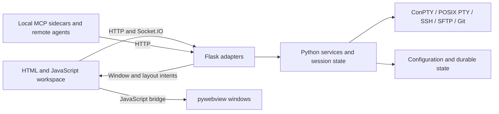
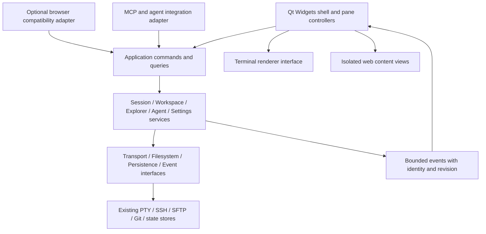

# GridVibe desktop transition: PySide6 feasibility whitepaper

**Date:** 6 October 2026  
**Baseline:** GridVibe 1.15.1, repository commit `6461825`, including current Unreleased behavior.  
**Status:** Research and proposed direction; no migration or product decision implemented.

## 1. Recommendation

**A PySide6 desktop version is feasible, and fits GridVibe's direction as a multi-pane developer workspace. It is a substantial frontend replacement and backend separation project.** The strongest opportunity is to make windows, workspace navigation, commands, settings, dialogs, and application lifecycle native while retaining the existing Python session, SSH, filesystem, Git, agent, and persistence behavior.

Start with **Qt Widgets and a renderer-independent application core**. Prove the terminal component and a distributable application before undertaking the full redesign. A terminal workspace cannot treat terminal emulation as a detail to solve after building its window chrome.

Three qualifications shape the decision:

1. **PySide6 retains Python.** It can deliver an installed application with its own runtime, so users need neither Python setup nor a checkout. Replacing the GUI does not itself remove packaging, subprocess, or concurrency problems.
2. **Current functionality includes web content.** Browser panes, executable HTML previews, and Mermaid rendering need an explicit rendering strategy. A native application with an embedded browser for browser content is a reasonable end state. A requirement for zero embedded web engines would change the feature set or create another substantial rendering project.
3. **HTTP has consumers beyond the GUI.** Local MCP sidecars, remote MCP over SSH forwarding, and agent conversation reporting currently use HTTP. Removing Flask from the desktop interaction path is achievable; removing every HTTP listener while preserving these integrations requires additional transport work.

The proposed decision is a **conditional go for a feasibility prototype**, followed by a full migration only when terminal compatibility, clean-machine packaging, and state preservation pass their gates. A hybrid terminal is a fallback to consider explicitly, not evidence that a fully native terminal has been delivered.

## 2. What “a proper standalone app” should mean

The outcome should be judged by observable behavior:

- Install and launch from an application shortcut, without a console, Python installation, pip, repository checkout, or browser URL.
- Open quickly into a useful workspace, with predictable keyboard focus, window placement, menus, dialogs, clipboard behavior, and scaling.
- Restore saved work accurately; distinguish closing a window, ending a workspace, and quitting the application.
- Remain responsive while SSH connects, terminals stream output, searches run, or voice recognition processes audio.
- Install updates without running Git inside the application directory or losing configuration and credentials.
- Present one coherent identity across the icon, title, installer, taskbar, settings, documentation, and diagnostics.

Qt Widgets provides desktop-oriented controls; Qt Quick is the alternative for a more extensively animated and custom visual interface. Neither toolkit guarantees a polished product without interaction design and platform testing. This paper's preference for Widgets follows GridVibe's dense, keyboard-driven workspace rather than a claim that Quick is unsuitable. [Qt UI comparison](https://doc.qt.io/qt-6/topics-ui.html)

Packaging the present application would already address part of the standalone goal. It is a useful baseline when assessing whether the Qt rewrite earns its cost. Likewise, a Qt window containing the existing entire web page changes the wrapper but achieves little of the proposed architectural simplification.

## 3. Current architecture and reusable assets

The repository already separates many domain operations into Python modules. However, those modules do not yet form a completely UI-independent backend.

### Repository evidence

| Area | Current evidence | Migration implication |
| --- | --- | --- |
| Application composition | [`web/app.py`](../web/app.py) creates Flask, Socket.IO in threading mode, and the shared session manager. | A desktop composition root must construct services without importing the web application. |
| Session model | [`sessions/manager.py`](../sessions/manager.py) owns sessions, groups, workspaces, identity and locks. | Strong reuse candidate; constructor dependencies and startup side effects still need characterization. |
| Terminal runtime | [`web/terminal_io.py`](../web/terminal_io.py) owns connection registries, pumps, input, resize and replay, and imports `session_manager` and `socketio` from `web.app`. | Preserve transports and policies, inject ownership and event delivery, and remove the dependency on the web singleton. |
| Terminal presentation | [`templates/terminals.html`](../templates/terminals.html) loads vendored xterm.js and its fit, search and link addons. [`terminal-replies.js`](../web/static/js/terminal-replies.js) contains correctness policy. | A new widget must replace both rendering and behavior; retaining the Python transport alone does not preserve terminal parity. |
| Workspace presentation | [`engineering_contracts.md`](engineering_contracts.md#presentation-persistence) documents revisioned state, cached groups, split geometry and durable presentation. | Some product logic currently belongs to JavaScript and must move or be reimplemented against shared fixtures. |
| Lifecycle | [`web/lifecycle.py`](../web/lifecycle.py) and the [window contract](engineering_contracts.md#workspace-lifecycle-and-windows) coordinate flush, save and close across windows. | Qt close events must participate in the same transaction guarantees. |
| Native bridge | [`web/webview_launcher.py`](../web/webview_launcher.py) owns workspace windows, focus, minimize and close integration. | Replace its mechanism with Qt window controllers; retain its user-visible behavior. |
| Agent integration | [`gridvibe_mcp/client.py`](../gridvibe_mcp/client.py) calls HTTP; the [MCP reference](../gridvibe_mcp/README.md) describes sidecars, page intents and SSH forwarding. | Preserve public tool semantics while changing internal dispatch. |
| Installation assumptions | [`web/paths.py`](../web/paths.py) derives `BASE_DIR` from source location and currently distinguishes Git and source installations. [`web/selfupdate.py`](../web/selfupdate.py) updates a checkout through Git. | Installed resource paths, writable data and packaged updates need distinct owners. |

These findings establish the seams, not a completed dependency audit. No defensible percentage of reusable backend code follows from counting Python files: a useful service may still rely on globals, emitted events, request adapters, or browser-owned state.

### Feature migration map

Risk is relative engineering uncertainty, not measured defect frequency.

| Capability to preserve | Likely reuse | Native work | Risk |
| --- | --- | --- | --- |
| Local, PowerShell, cmd, WSL and SSH terminals | Existing PTY/ConPTY/Paramiko transport, cwd observation, input and shutdown rules | Terminal widget, key translation, resize, scrollback, selection, search, broadcast and query replies | Very high |
| Agent panes and shell/agent switching | Launch composition, detection, activity, handoff/results, optional conversation restore | Menus, state presentation, dashboard, crew links and graph, notifications | High |
| Workspaces, groups, pane splits, moves and multiple windows | Identity, capacity, validated state, lifecycle services | Layout model, geometry, cached views, focus and window controllers | High |
| Local/SFTP explorer and transfers | Root confinement, pools, bounded operations, revisions, search and Git operations | Lazy tree model, multi-selection, drag/drop, progress, cancellation and error flows | High |
| Source, editing, Diff and Git sidebar | Content/revision handling and Git backend | Editor, syntax/folds, search marks, commit graph, line/block undo and large-file tiers | High |
| Browser panes | URL/tab persistence and policy | WebEngine tabs, navigation/popups, downloads and permissions | Medium–high |
| Markdown, Mermaid, images and HTML preview | Content acquisition and current safety policy | Native text/image views plus a defined rich-content renderer | High |
| Settings, presets and restore | `RuntimeConfig`, validation, state files, credential encryption | Native forms, presentation adapters and legacy import | Medium–high |
| Voice | Recognition engines and delivery semantics | Microphone capture, format conversion, device settings, push-to-talk and editor binding | Medium–high |
| Installation, update and rebrand | Version metadata and selected assets | Bundling, installer, data locations, update delivery, identifiers and migration UX | High |

The baseline for this table is the current [README](../README.md), [engineering contracts](engineering_contracts.md), [state guide](session_state_guideline.md), and [voice guide](voice_guideline.md). Preserving functionality includes their failure and recovery behavior, not just the visible buttons.

## 4. Options and tradeoffs

| Option | Benefit | Cost or limitation | Assessment |
| --- | --- | --- | --- |
| Package and polish the current stack | Fastest route to installation and fewer setup problems | Retains browser-owned workspace and web/native coordination | Useful baseline or fallback; limited answer to the requested redesign |
| Qt wrapper around the complete existing page | Reuses nearly all frontend code | Still a web application inside a window; introduces another packaging configuration | Does not justify a major rebrand on its own |
| Native Widgets shell with xterm.js components | Native navigation, windows and settings; preserves a mature terminal renderer | Retains JavaScript, a bridge and WebEngine memory/deployment costs | Pragmatic transitional route if explicitly accepted |
| Native Widgets shell and native terminal | Best alignment with the proposed direction; desktop interaction no longer depends on a browser | Terminal compatibility and renderer ownership become major commitments | Preferred target, conditional on the prototype |
| Qt Quick/QML shell | More freedom for animation, branding and GPU-driven custom presentation | Another UI language and custom component work; still needs terminal and editor solutions | Reconsider if visual direction requires it; do not run two full shell implementations |

### Expected advantages

- Native application commands can directly invoke services, removing serialization, page readiness and HTTP request context from normal desktop actions.
- Qt can own window identity, focus and application lifetime directly, reducing the need for a page to mediate native window operations.
- A shared Python core can serve desktop, automation and a retained browser adapter with one owner for policy.
- A model/view explorer and explicit pane controllers offer a clearer place to manage data, view state and asynchronous ownership.
- Distribution can hide the Python environment from users and make application data independent of the checkout.

### Costs and limits

- Most HTML/CSS and DOM orchestration will be replaced. Existing Python tests do not establish correctness of the new GUI.
- xterm.js currently supplies substantial functionality that ordinary Qt text controls do not replace.
- A native explorer/editor is itself a sizeable application surface; Git graphs, folding, diff undo and large-file behavior remain engineering work.
- WebEngine may still be necessary for current web features, reducing potential memory and package-size savings. Qt WebEngine ships Chromium-related resources and a helper process. [WebEngine deployment](https://doc.qt.io/QT-6/qtwebengine-deploying.html)
- Python CPU work can still delay the interface. Threading, bounded queues and occasional worker processes remain necessary.
- Maintaining browser and desktop interfaces indefinitely creates two presentation products. Keeping browser compatibility should be a deliberate product decision after the desktop transition stabilizes.

**There is no measured performance case yet.** Lower latency, smaller memory use and faster startup are hypotheses to test against the current application, including a packaged baseline where practical.

## 5. The terminal decision is the first breakpoint

### Transport, emulation and painting are separate

GridVibe already has much of the transport layer: process creation, Windows ConPTY through pywinpty, POSIX PTYs, SSH channels, resizing and bounded input. Preserve that work initially.

The emulator interprets terminal escape sequences and maintains cells, modes, cursor and scrollback. The view paints those cells and handles keyboard, selection, mouse, clipboard, fonts and accessibility. `QPlainTextEdit` is a text editing building block, not a ready replacement for xterm.js. [Qt text editor API](https://doc.qt.io/qt-6/qplaintextedit.html)

Similarly, launching a shell with ordinary `QProcess` pipes does not establish a PTY/ConPTY session. Do not substitute it for current terminal transport merely because it belongs to Qt. Windows pseudoconsole setup has explicit creation, communication and process attachment steps. [QProcess](https://doc.qt.io/qt-6/qprocess.html), [Microsoft pseudoconsole guide](https://learn.microsoft.com/en-us/windows/console/creating-a-pseudoconsole-session)

### Candidate assessment

| Candidate | What the evidence establishes | Remaining work / decision |
| --- | --- | --- |
| QTermWidget | An existing Qt 6 terminal widget. Upstream names BSD, Linux and OS X, documents PyQt bindings, and identifies GPLv2-or-later licensing with some differently licensed files. | Upstream does not establish a supported Windows/PySide6 path. Prove those bindings/builds and distribution terms before selecting it for this Windows-heavy project. |
| `pyte` plus a custom Qt view | An in-memory VT-family emulator, with no complete desktop widget supplied by that description. | Implement painting/input and prove modern CLI compatibility, Unicode, scrollback and throughput. Useful for a spike; not evidence of product readiness. |
| `libvterm` plus bindings and a custom Qt view | A C terminal emulation library, offering a lower-level native engine route. | Own bindings, builds, renderer and input behavior. A candidate when the team accepts maintaining a terminal component. |
| Vendored xterm.js inside a dedicated Qt WebEngine view | Retains the renderer already used by GridVibe. Qt WebChannel can connect JavaScript and exposed Qt objects. | Adapt stream/input/resize delivery, apply strict bridge isolation and benchmark multi-pane overhead. This is a hybrid terminal. |

Primary references: [QTermWidget upstream](https://github.com/lxqt/qtermwidget), [pyte upstream](https://github.com/selectel/pyte), [libvterm author](https://www.leonerd.org.uk/code/libvterm/), [Qt WebChannel](https://doc.qt.io/qt-6/qwebchannel.html).

For a hybrid spike, load bundled terminal resources and expose only that pane's input, output and resize interface. Do not expose the general application service container to JavaScript. A WebChannel is a bridge mechanism; it is not authorization. Restrict navigation, detach the bridge on unexpected navigation, and never share it with browser or repository HTML content. xterm.js also explicitly treats terminal/browser integration as a security boundary. [xterm.js security guidance](https://xtermjs.org/docs/guides/security/)

### Terminal acceptance corpus

Exercise cmd, PowerShell, WSL and SSH with real interactive programs and supported agent CLIs. Include:

- Alternate-screen entry/exit, cursor positioning, erase modes, true color and repeated full-screen redraws.
- Unicode wide characters, combining characters, emoji and font fallback; IME composition and non-US keyboards, including AltGr.
- Bracketed paste, multi-line input, Ctrl+C, modified function keys, mouse reporting, selection and clipboard permissions.
- Resize while streaming, hide/show and tab switches, search and scrollback, replay, clear/reset and reconnect.
- OSC cwd/title observation and terminal queries, including delayed color/cursor replies after restore.
- Simultaneous busy panes, one slow SSH pane, pane replacement during output and close during connection setup.

The existing [terminal contract](engineering_contracts.md#terminal-transport-and-working-directories) contains query-age filtering, incremental decoding and partial-write rules. These are especially important for agent CLIs: a delayed terminal response can become input in a later prompt. Preserve these protections when changing delivery mechanisms.

**Gate:** if the native candidate cannot satisfy this corpus and package on Windows within the feasibility timebox, choose an explicitly scoped hybrid release, fund terminal development separately, or stop the full-native proposal. Do not use a successful colored-text demo as the go decision.

## 6. Proposed application architecture

The names below describe proposed responsibilities, not existing APIs:

- `ApplicationServices`: creates and owns services, pools, configuration and shutdown order. No Flask, Qt or page globals in its public boundary.
- Commands and queries: operations such as launch pane, change mode, save workspace and list files return typed results/errors. Adapters translate those results into HTTP responses, MCP results or GUI notifications.
- `EventSink`: scoped output, status and model changes. Events identify workspace, group, pane and connection generation; terminal output also has ordering metadata.
- `TerminalView`: feed output, capture view state, resize, selection/search and input events. It must not own SSH credentials or choose how processes launch.
- `WorkspaceController`: owns visible and cached pane models, active group, measured geometry and presentation flush. Widgets represent this state rather than becoming its only repository.
- `WindowController`: owns a workspace window and implements native focus, placement, close and MCP layout intents on the GUI thread.

A possible eventual layout is `core/`, `desktop/`, and `adapters/`, with current domain modules extracted gradually. Do not begin by renaming `web/`: its location is less significant than its imports and side effects. Use the existing `session_modes.py` / `session_shell.py` extraction pattern described in the [architecture contract](engineering_contracts.md#architecture-and-extraction-boundaries).

### Threads, events and process lifetime

Qt widgets must be used on the main thread. Run blocking SSH, SFTP, Git, search and recognition work away from it; marshal completions through queued signals/slots to the owning controller. Preserve the existing lock order and never invoke GUI work or perform I/O under shared registry locks. [Qt thread and object rules](https://doc.qt.io/qt-6/threads-qobject.html)

Use bounded queues and batch output rather than emitting one GUI signal per character. Coalesce replaceable status and resize events, but do not silently drop terminal stream bytes: losing an escape-sequence fragment can corrupt emulation. Apply bounded backpressure and explicit failure/resynchronization policy. Hidden views should suspend painting while retaining the processing/state needed for correct return to the pane.

Start with one application process owning services and multiple Qt windows. Closing one window must not destroy its sessions or quit the process when the existing close-window semantics say they stay alive. Configure and test last-window-close behavior explicitly. An independent daemon would add crash isolation and possible session survival, but also IPC, reconnect, authentication and upgrade coordination. It is a separate enhancement; the current application does not keep sessions alive across process exit.

### Layout is a model migration

Qt splitters are useful controls, but existing rectangle/track-weight layouts may not all map to a simple recursive splitter tree. Test real stored arrangements first. Either preserve the current geometry in a custom layout manager or implement a lossless conversion for the supported subset and explicitly handle other layouts. Keep pane identity independent of widget index.

Port DOM-free split/resize and persistence policy using common fixtures against both JavaScript and Python during migration. Replace page measurements with Qt logical dimensions and terminal cell metrics. Do not discard saved layout semantics just to fit the first widget implementation.

## 7. What happens to HTTP, Flask and MCP?

Use two migration milestones:

1. **Desktop independent of HTTP:** native controls call extracted services; the old adapter can still serve integrations and the legacy browser UI.
2. **Flask no longer required by the desktop distribution:** integration consumers have moved to a deliberate replacement adapter, or an optional compatibility component supplies them.

Local MCP currently runs as a child of the agent CLI, with an interpreter command and `GRIDVIBE_*` identity environment. It reaches GridVibe through `GridVibeClient`. A packaged application needs a bundled sidecar executable or a dedicated executable mode that runs MCP over stdio without initializing the GUI. A frozen application executable cannot be assumed to accept arbitrary `python -m` arguments. Preserve the external names and identity rules during rebranding. [Current MCP startup and identity](../gridvibe_mcp/README.md#how-it-starts)

The [remote MCP path](../gridvibe_mcp/README.md#ssh-panes) uses streamable HTTP through a restricted reverse SSH forward, a per-pane token and remote config files. Keeping this HTTP endpoint is the lowest-risk compatibility choice even after the desktop no longer uses HTTP. It can eventually live in a small adapter calling the core; replacing Flask is not the same operation as deleting the protocol.

Local-only IPC could later use OS local sockets or named pipes with access controls and peer validation. That does not automatically solve remote CLI compatibility. A strict zero-HTTP requirement therefore needs a separately designed remote relay or changes to the supported integration surface.

The [current page-intent mechanism](../gridvibe_mcp/README.md#splitting-resizing-showing-and-opening-windows-need-a-page) must become a Qt controller mechanism. Preserve claim ownership, bounded completion, actual-result reporting, focus policy and hidden-window refusal behavior. Dispatching an event is not proof that a pane split succeeded. Keep the human-only MCP override grant behind its explicit native warning and confirmation; tools must not acquire it by calling the new service API.

Agent conversation hooks also need their per-connection authenticated reporting route preserved or migrated. Maintain token revocation and redaction, optional conversation-restore gates, and the rule excluding conversation IDs from public status and logs. See the [conversation restore contract](engineering_contracts.md#agent-conversation-restore).

## 8. Breakpoints that can derail the transition

| Breakpoint | Typical failure | Required mitigation / evidence |
| --- | --- | --- |
| Terminal renderer | Agent TUI appears correct initially but corrupts input after resize or restore | Pass the terminal corpus and sustained multi-pane workload before approving the renderer |
| Backend extraction | Importing a “core” service creates Flask objects or assumes request/Socket.IO context | Instantiate and test extracted services without the web or Qt adapters |
| Resource ownership | A delayed SSH/search completion updates a replacement pane | Carry captured object/generation identity and recheck on completion |
| GUI thread | Save/close blocks while waiting for a GUI-thread flush acknowledgement | Asynchronous close state machine; fail save without destroying the window |
| Split conversion | Existing saved layouts reopen with missing panes or changed proportions | Fixture migration for stored geometry, including holes and background groups |
| State location and credentials | New brand opens an empty workspace or cannot decrypt saved passwords | Explicit import of config, presets, snapshots, encryption key and trust store as a coherent set |
| Browser/HTML isolation | Repository HTML gains a native bridge or access to local control APIs | Separate profiles/views, no privileged bridge, constrained resource/navigation policy and hostile-content tests |
| Explorer replacement | Local Qt file APIs bypass SFTP confinement or conflict protection | Native tree models consume existing domain operations for both local and remote roots |
| Installed MCP | CLI tries to launch a nonexistent development interpreter or recursively starts the GUI | Exercise packaged stdio sidecar and remote MCP from a clean installation |
| Packaged updates | Current Git updater writes into a protected installation directory | Separate source-install update behavior from installed-package updates |
| Keyboard routing | Global shortcuts steal input from terminals or editors | Explicit focus/context rules, IME and AltGr coverage, platform shortcut testing |
| Voice capture | Recognition results land in whichever pane is now focused | Preserve recording-owner identity, PCM format and editor undo semantics |
| Rebrand | Renamed paths/environment keys break old saved setups and tool configs | Separate display identity from persistent/protocol identity; ship aliases and an importer |

### Rich content needs two trust models

A browser pane intentionally visits HTTP/HTTPS applications, including localhost development servers. A repository HTML preview currently runs scripts under a restrictive sandbox that prevents reaching GridVibe and making arbitrary network connections. These must remain separate policies. A new `QWebEngineView` displaying a repository file directly is not an equivalent sandbox.

Use distinct views/profiles and explicit request/navigation policy. Profiles offer storage and settings separation; they do not by themselves replace the current opaque-origin iframe/CSP restrictions. Prototype the sandboxed document container or custom resource scheme and test fetch, forms, subframes, popups, local files, downloads and control-plane access before retiring the current preview. [Qt WebEngine profiles](https://doc.qt.io/qt-6/qwebengineprofile.html), [current preview security contract](engineering_contracts.md#security-and-trust)

Top-level browser views also differ from iframes in embedding and navigation behavior. Document this intended product change rather than claiming exact equivalence with the current Browser Preview implementation.

For native source/editing, Qt text controls and models are starting points. Existing folding, revision conflicts, diff actions, large-file limits and undo behavior remain acceptance requirements. Markdown's basic text rendering does not cover Mermaid or executable HTML.

For voice, `QAudioSource` is a capture candidate. Preserve 16 kHz mono PCM at the recognizer boundary through negotiated capture format and conversion, rather than assuming every microphone supplies it. Keep recognition off the GUI thread and preserve one-active-recording and captured-editor ownership rules. [Qt audio capture](https://doc.qt.io/qt-6/qaudiosource.html), [GridVibe voice contract](voice_guideline.md)

## 9. Distribution, data migration and licensing

### Package from the first prototype

Evaluate Qt's `pyside6-deploy`, which uses Nuitka and supports directory-based `standalone` output as well as `onefile`. Begin with the directory form inside an installer or test ZIP so resources, helper executables and plugins are visible and diagnosable. Commit reproducible build configuration once a build path is selected. [Official deployment tool](https://doc.qt.io/qtforpython-6/deployment/deployment-pyside6-deploy.html)

Pin a supported Python/PySide6/build-tool combination after checking wheels, target OS support and native dependencies. The repository's Python 3.10+ declaration is not proof that every future PySide6 version supports that complete range. Research here uses rolling upstream documentation; it intentionally does not select a “latest” version for production.

Validate on a machine with no Python, Git checkout or developer tooling. Bundle required Qt plugins, fonts/assets, pywinpty/native libraries, cryptography dependencies, the MCP entry point and WebEngine resources if used. Installers and update delivery are additional work beyond freezing Python.

Agent CLIs, Git, WSL distributions, credentials and user repositories are external capabilities. A standalone GridVibe does not imply bundling every external tool. Detect missing capabilities and provide useful setup guidance. Optional speech packages and model files need an installed-product delivery strategy; running pip against the source application's environment is not an adequate frozen-app design.

### Separate resources from mutable data

Use platform-appropriate application data, configuration and cache locations, with an intentional portable mode only if desired. `QStandardPaths` supplies location categories. Continue to use GridVibe's existing durable JSON transaction machinery for its state instead of silently moving it to a different persistence mechanism. [Qt standard paths](https://doc.qt.io/qt-6/qstandardpaths.html)

Legacy import must be explicit and recoverable:

1. Detect or let the user select the old installation; show the data source and intended destination.
2. Validate versions and copy a consistent set of settings, presets, snapshots, encryption key and known-host information; preserve permissions and original files.
3. Refuse or explain missing keys and unsupported state instead of claiming successful credential migration.
4. Record schema/import status atomically. Test restoration using representative old fixtures before making the new installation authoritative.
5. Keep rollback data separate. Old and new versions should not concurrently write the same mutable stores by default.

Do not promise transfer of live terminals across application processes. Existing workspace restore relaunches sessions; it is not process checkpointing. Keep experimental conversation restore opt-in and distinguish it from shell-process survival.

Source installations may retain their Git update path. Packaged releases need signed/versioned artifacts, save-before-restart, failure recovery and a documented rollback path. OS-specific installers, signing and macOS notarization belong in release work; WebEngine adds deployment requirements of its own. [WebEngine distribution reference](https://doc.qt.io/QT-6/qtwebengine-deploying.html)

### Dependency licenses are a selection gate

GridVibe currently declares MIT in [`pyproject.toml`](../pyproject.toml). Qt for Python offers LGPLv3/GPLv3 and commercial licensing, and Qt modules/third-party components do not all have identical terms. Review the exact shipped dependency set, notices, source/replacement obligations and packaging arrangement before distribution; a commercial license is not automatically required merely because an application is sold. [Qt for Python](https://doc.qt.io/qtforpython-6/), [Qt licensing](https://doc.qt.io/qt-6/licensing.html), [Qt LGPL obligations](https://www.qt.io/development/open-source-lgpl-obligations)

QTermWidget's documented project license makes it a materially different dependency decision from adopting PySide6 alone. Avoid selecting it on the assumption that all Qt widgets carry Qt's licensing terms. Final distribution compliance requires review of the actual component versions and build, not just this research table.

## 10. Rebranding as a product workstream

The strongest positioning is **a desktop workspace for terminals, repositories and coding agents**. Preserve the useful distinction between workspace, session tab and pane, while making labels consistent in onboarding, menus and saved-state explanations.

Develop the visual system in parallel with the feasibility prototype:

- Define iconography, typography, spacing, density, theme colors and active/focused/broadcast states.
- Design the everyday route: launch or restore workspace → work across panes → inspect files/agents → save and close.
- Prefer standard window behavior and clear command locations; make custom chrome earn its complexity.
- Use one shared action model for menus, context menus, keyboard shortcuts and command search so availability and wording stay consistent.
- Keep critical states visible: wrong host/root, active broadcast, unsaved edits, disconnected terminals, save refusal and tool override.

Name selection should consider pronunciation, searchability, application-store/package identifiers, domain availability and potential trademark conflicts; no availability checks or name clearance were performed here. A name can be selected after the technical gate without delaying the service extraction.

Separate **display branding** from **compatibility identifiers**. Window titles and installer artwork can change before `GRIDVIBE_*` environment variables, MCP server names, data schemas or legacy paths. Keep these stable initially, then migrate with versioned aliases when justified. Changing every identifier together makes failures much harder to diagnose and rollback.

## 11. Staged migration and decision gates

Keep the current frontend usable while extracting and proving each service. During development, use separate test data directories and migrate fixtures rather than repeatedly importing a live user's state.

| Stage | Deliverable | Exit gate | If it fails |
| --- | --- | --- | --- |
| 0. Baseline and scope | Capability checklist, real saved fixtures, repeatable workloads, OS priorities and “native” definition | Agree which capabilities must match and which product differences are intentional | Resolve scope before a large rewrite |
| 1. Terminal and package spike | One Qt window, real local/WSL/SSH terminal paths, native candidate plus a hybrid comparison if needed, distributable build | Terminal corpus, busy-pane responsiveness, clean-machine launch and acceptable dependency terms | Select fallback or stop native-renderer investment |
| 2. Core extraction | Injectable services/events and desktop composition root, current web adapter still operational | Core behavior tested without Flask/Qt; adjacent web regressions pass | Refine service boundary without redesigning the frontend |
| 3. Native workspace alpha | Launcher, settings, groups, splits, multiple windows, save/restore, native lifecycle and MCP intents | Reopen legacy layouts; failed save leaves app open; background actions preserve identity/focus | Hold release and correct ownership/state model |
| 4. Functional parity beta | Explorer/editor/Git, agents/dashboard, browser/rich previews, voice and integration compatibility | Every baseline capability is passed or explicitly approved as changed | Remain beta; do not silently drop difficult features |
| 5. Branded desktop release | Installer, import flow, update delivery, accessibility/OS validation and support diagnostics | Clean-machine end-to-end use, rollback rehearsal and platform acceptance | Retain prior stable release |
| 6. Retire migration adapters | Remove unused UI/API dependencies after consumer audit | No remaining consumer relies on the removed surface | Keep narrowly scoped compatibility adapter |

Browser mode remains a useful regression reference during this sequence. At the release gate, decide whether it stays a supported product, becomes a separately installed adapter, or receives a documented retirement path. The research request does not itself decide that tradeoff.

### First implementation slice

The first follow-up should be a bounded feasibility branch, not a wholesale application rewrite:

1. Record the baseline scenarios and performance harness using the existing application.
2. Define an event/transport seam around terminal connection, input, output, resize and close; preserve current policies and ownership.
3. Add a Qt application with one terminal pane, then four simultaneous panes. Exercise one pane replacement and one reconnect under output.
4. Compare candidate renderers with identical traces and actual agent CLIs. Include Windows packaging immediately.
5. Demonstrate native save/restore and a failed-save close cancellation using a small representative workspace.
6. Produce a packaged artifact, compatibility results, measured resource costs and a short architecture decision selecting the renderer.

This slice should establish whether the hardest part can work in the intended shipping form. Branding mockups can accompany it, but should not consume the terminal/packaging investigation timebox.

## 12. Validation and performance evidence

Reuse Python domain tests and keep adapter regressions while extracting. Port important DOM-free JavaScript policy with shared input/output fixtures; do not mechanically rewrite tests that merely assert markup. Add Qt interaction coverage with QtTest or a suitable Python Qt harness for focus, close cancellation, signals and model updates, plus manual real-platform checks where automation is insufficient.

| Measurement | Suggested workload | Decision use |
| --- | --- | --- |
| Startup | Cold and warm launch into empty and saved multi-pane workspaces | Assess perceived standalone experience; separate shell readiness from GUI readiness |
| Input latency | Instrument send-to-visible-echo with 1, 4 and 16 panes, idle and under output | Compare p50/p95 and worst stalls on the same machine |
| Throughput/fairness | Fixed-size output replay plus interactive input in another pane | Detect starvation, stream corruption and unbounded queues |
| Memory and processes | Empty app; terminal-only grid; browser/HTML panes; repeated open/close cycles | Include all renderer/helper processes; detect growth after settling |
| Layout/focus | Resize, tab switch, pane moves, monitor changes and mixed DPI | Find lost focus, inaccurate sizing and expensive rebuilds |
| Persistence | Old fixtures, revision conflicts, disk errors, interrupted import, multiple windows | Prove that failed operations do not claim success or destroy data |
| Shutdown | Busy SSH, active search, voice, pending save and spawned sidecars | Verify bounded cleanup, cancellation and no leaked owned processes |

Example **provisional targets**, to calibrate against baseline hardware: warm empty-window readiness under two seconds, p95 local echo under 50 ms when idle, no routine GUI-thread stall above 100 ms during background I/O, and stable post-cleanup memory after 100 pane open/close cycles. These are proposed acceptance goals, not measurements or Qt guarantees. SSH/network latency must be reported separately.

Windows is the proposed first validation platform because of GridVibe's ConPTY/WSL integration and this development environment. Retain Linux/macOS portability in the design, but do not claim support for either without builds and tests. Include non-US keyboards, high DPI, multiple monitors, accessibility navigation, suspend/resume and failed network operations in the release matrix.

## 13. Effort, uncertainty and next decisions

For planning only, assuming one experienced developer working substantially full-time with the existing project knowledge:

| Scope | Initial planning allowance | Confidence |
| --- | --- | --- |
| Feasibility prototype and decision report | 2–4 engineering weeks | Medium; discovering a renderer blocker is a valid result |
| Useful native workspace alpha after a successful spike | A further 6–12 engineering weeks | Low–medium; includes service extraction, basic multi-pane workflow and persistence |
| Desktop release with broad current functionality, using a proven renderer | Roughly 6–12 person-months total, including earlier stages | Low; explorer/editor parity and distribution dominate remaining work |
| Custom native terminal engine integration and renderer | Potentially several additional person-months and ongoing maintenance | Very low until compatibility and Windows packaging are demonstrated |

These are judgment-based ranges, not estimates derived from an implementation backlog. They exclude an independently supervised session daemon and a separately funded ongoing browser redesign. Maintenance of the shipping application, extensive new branding, additional OS certification, or scope growth can extend elapsed time. Re-estimate after the spike from observed work and explicit parity cases.

The next decisions, with proposed defaults, are:

| Decision | Proposed default |
| --- | --- |
| Desktop toolkit | PySide6 Qt Widgets |
| Native terminal requirement | Preferred target; make the renderer prototype decisive |
| Hybrid terminal fallback | Present it explicitly if the native candidate fails; do not assume acceptance |
| Embedded web content | Retain isolated browser/HTML rendering for current functionality |
| Desktop/backend communication | Direct application services and bounded events |
| Integration HTTP | Retain narrowly scoped compatibility while moving the UI off HTTP |
| Session ownership | One application process initially; no promise of survival after process exit |
| Initial platform | Windows first, with portability preserved and other releases gated on testing |
| State compatibility | Legacy import with backups and unchanged credential/trust guarantees |
| Rebrand timing | Design in parallel; finalize shipping identity after technical feasibility |

**Recommended next commitment:** the 2–4 week terminal, core-boundary and packaging spike. Its deliverable should make the full migration decision evidence-based: a runnable artifact, terminal compatibility results, performance comparison, state/lifecycle proof, and an explicit native-versus-hybrid renderer choice.

## Research scope and limitations

This paper combines the current repository's maintained contracts and selected source inspection with primary Qt, Microsoft and terminal-project references accessed on 6 October 2026. The architectural recommendation, staged plan, risk ratings, performance targets and effort allowances are analysis and proposals.

No Qt prototype, dependency installation, renderer benchmark, binary build, license clearance, name clearance or operating-system certification was performed for this document. Rolling upstream documentation can describe different releases; validate the selected version's documentation and actual artifacts when implementation begins. The repository's maintained engineering contracts remain authoritative for current behavior; this proposal does not replace them.
